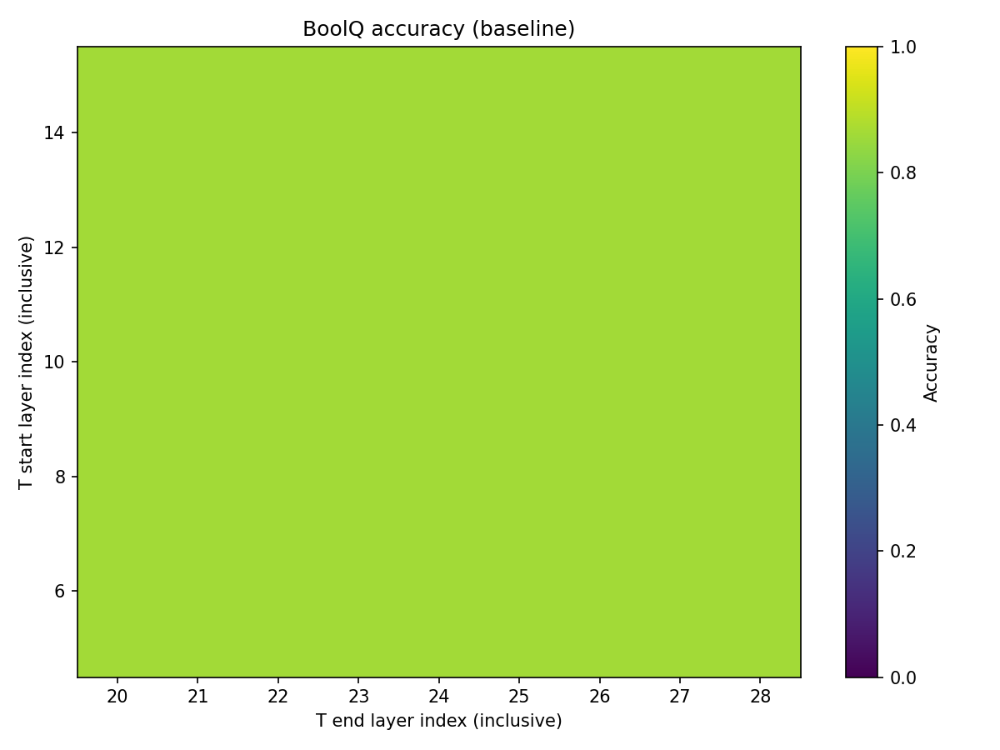
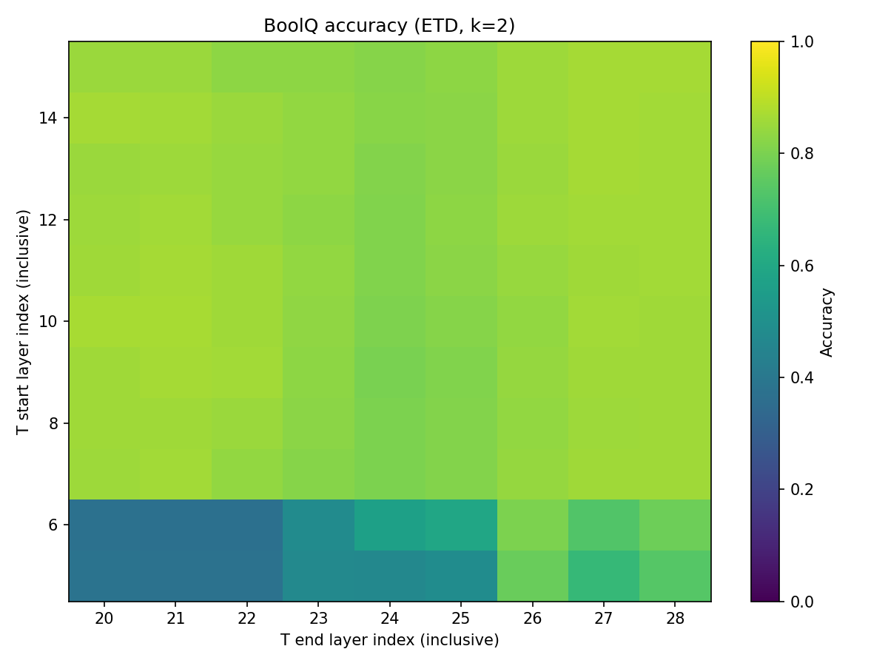
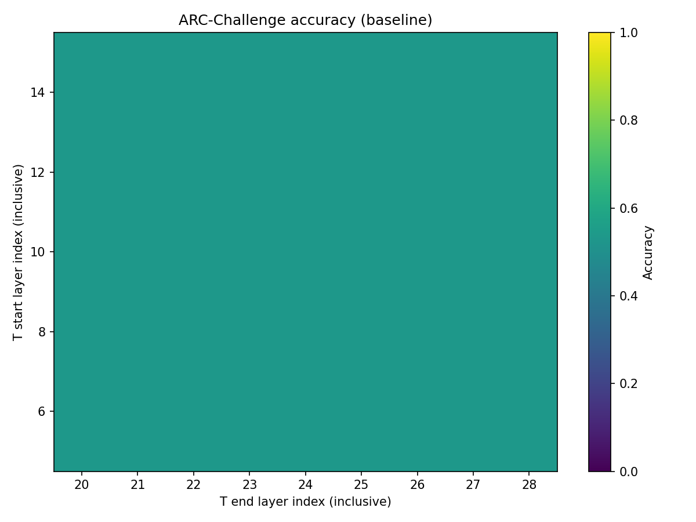
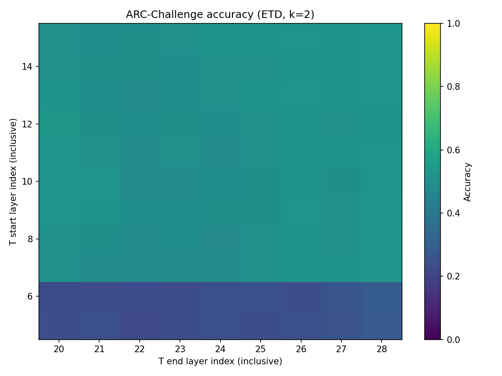
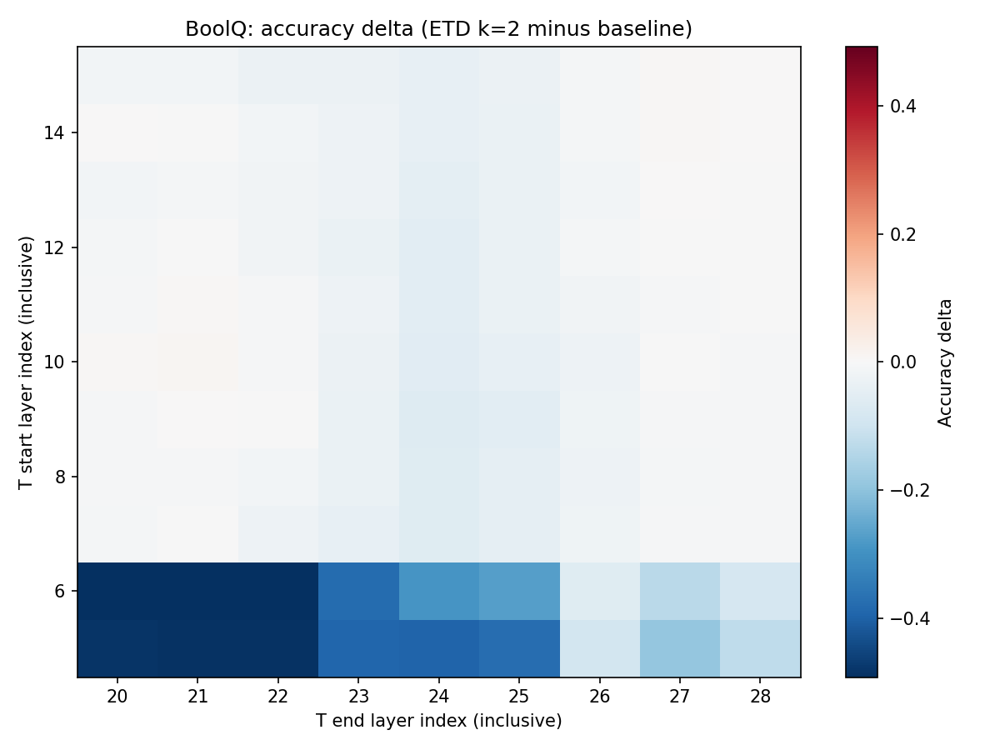
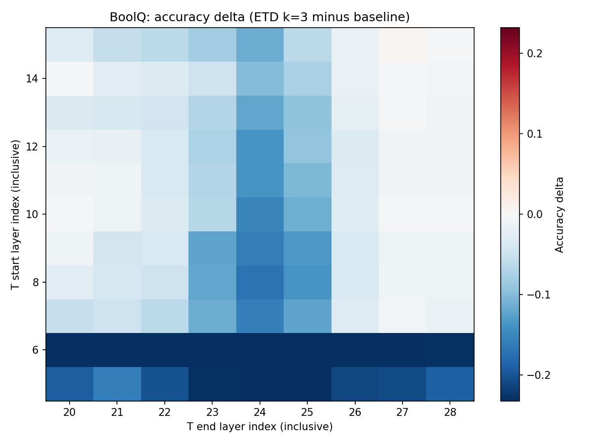
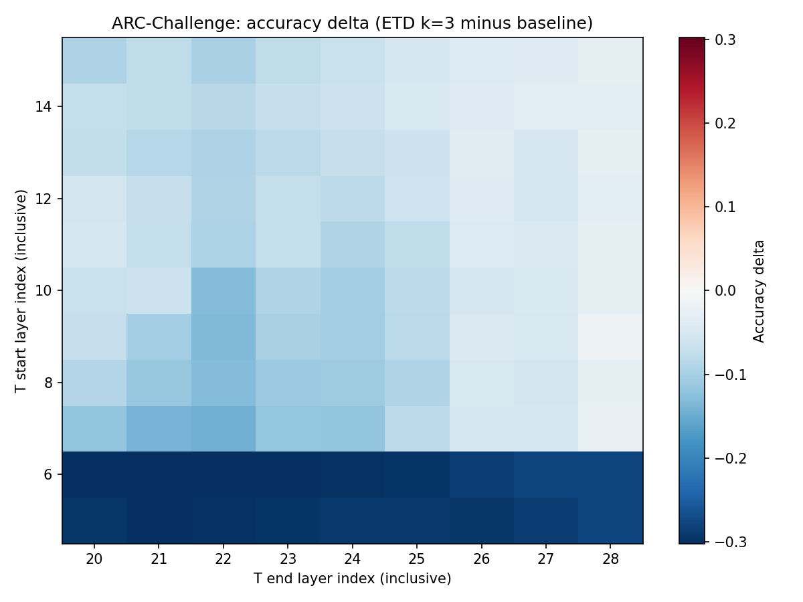

# ETD Layer Sweep Experiment Report

## 摘要（中文）

本报告对应 **T 思考块层区间** 网格搜索：`t_start`∈[5,15]、`t_end`∈[20,28]、且 `t_start≤t_end`，共 99 组；每组在 **相同的 BoolQ / ARC 样本列表** 上对比 **baseline、ETD k=2、k=3**。图表标题与图例均为英文。

## Setup
- Model: Qwen3-8B (local path from sweep script).
- Thinking block **T** uses contiguous layers `[t_start, t_end]` (inclusive, 0-based).
- Encoder **E** = layers `0 .. t_start-1`, **D** = layers `t_end+1 .. 35` (36 layers total).
- Sweep: `t_start` in [5, 15], `t_end` in [20, 28], all pairs with `t_start <= t_end`.
- Modes per cell: **baseline** (standard forward), **ETD k=2**, **ETD k=3**.
- **BoolQ** and **ARC** use the **same fixed example lists** for every cell (see limits below).
- Rows in CSV: **99** (full sweep expected **99**).
- Default BoolQ limit: **500** (split: validation).
- Default ARC limit: **500** (split: test).

## Summary statistics

| Metric | Mean | Std | Max | Best t_start | Best t_end |
|--------|------|-----|-----|--------------|------------|
| boolq_baseline | 0.8620 | 0.0000 | 0.8620 | 5 | 20 |
| boolq_k2 | 0.7893 | 0.1356 | 0.8700 | 10 | 21 |
| boolq_k3 | 0.7799 | 0.0782 | 0.8660 | 15 | 27 |
| arc_baseline | 0.5320 | 0.0000 | 0.5320 | 5 | 20 |
| arc_k2 | 0.4557 | 0.1011 | 0.5300 | 12 | 20 |
| arc_k3 | 0.4204 | 0.0901 | 0.5160 | 9 | 28 |

## Figures

### BoolQ accuracy (baseline)

### BoolQ accuracy (ETD, k=2)

### BoolQ accuracy (ETD, k=3)

### ARC-Challenge accuracy (baseline)

### ARC-Challenge accuracy (ETD, k=2)

### ARC-Challenge accuracy (ETD, k=3)

### Accuracy delta (ETD minus baseline)

**BoolQ, k=2 minus baseline**

**BoolQ, k=3 minus baseline**

**ARC, k=2 minus baseline**

**ARC, k=3 minus baseline**

## Runtime

- Total wall time (sum over cells): **66122.5** s.
- Mean seconds per cell (all modes, both benchmarks): **667.90** s.
