# ETD 信号探索研究综合报告：R32 至 R41

> **研究对象**：ETD（Early Thinking Deepening）——一种无需重新训练、通过在推理期将 Transformer 中间层组成的"T-block"重复执行 k 次以增强模型推理能力的方法。  
> **本文范围**：R32 至 R41 共 10 轮迭代实验，聚焦"如何找到一个可靠的逐样本信号，用来预测某个特定窗口对当前输入是否有益"。  
> **核心模型**：Qwen3-8B（36 层，隐藏维度 4096，中间层 11264），并在 R38 之后扩展至 Llama3-8B 与 Gemma2-2B。  
> **评测基准**：BoolQ、ARC-C、CSQA、TruthfulQA、MMLU-HS-Math、GPQA-Diamond、AGIEval-Gaokao-MathQA、LogiQA，以及 BBH（6 子任务）和 GSM8K。

### 附图路径说明（与 `ETD_Research_Report.md` 一致）

本文件与 `ETD_Research_Report.md` 位于同一目录：`loop_layer/experiments/`。文中所有插图使用 **相对该目录** 的路径，形式为：

`figures/<文件名或子目录>/...png`

与主报告中的写法相同，例如 `figures/r20_dashboard.png`。Markdown 预览会把链接解析为「当前 `.md` 文件所在目录」下的相对路径，从而正确找到 `experiments/figures/` 下的图片。

**请勿**使用以 `/root/` 或 `autodl-tmp/...` 开头的绝对路径作为图片链接——在多数 Markdown 预览器中会无法加载。

---

## 目录

1. [背景：ETD 算法与冠军配置](#1-背景etd-算法与冠军配置)
2. [R31 遗留问题：一阶信号的系统性失败](#2-r31-遗留问题一阶信号的系统性失败)
3. [R32：从一阶失败到二阶信息论——泰勒-海森理论分析](#3-r32从一阶失败到二阶信息论泰勒-海森理论分析)
4. [R33：FFN 慢权重相变与注意力快权重幂迭代信号](#4-r33ffn-慢权重相变与注意力快权重幂迭代信号)
5. [R34：方向与跨模块交叉交互信号](#5-r34方向与跨模块交叉交互信号)
6. [R35：Attention-FFN 非对易交换子实验](#6-r35attention-ffn-非对易交换子实验)
7. [R36：方向特异性传播增益实验](#7-r36方向特异性传播增益实验)
8. [R37：信号引导 ETD 选层（过渡实验）](#8-r37信号引导-etd-选层过渡实验)
9. [R38：全 Benchmark 信号优化实验](#9-r38全-benchmark-信号优化实验)
10. [R39：跨架构 ETD 根因分析与信号筛选](#10-r39跨架构-etd-根因分析与信号筛选)
11. [R40：BBH + GSM8K 三模型评测](#11-r40bbh--gsm8k-三模型评测)
12. [R41：回流敏感度与 Jacobian 衰减复合信号](#12-r41回流敏感度与-jacobian-衰减复合信号)
13. [纵向总结：十轮迭代的信号探索轨迹](#13-纵向总结十轮迭代的信号探索轨迹)

---

## 1. 背景：ETD 算法与冠军配置

### 1.1 ETD 算法描述

ETD 将推理过程分为三个阶段：

```
Input → [E-block: 层 0..n_e-1] → [T-block: 层 n_e..n_e+n_t-1]^k → [D-block: 剩余层] → Output
             固定执行一次                       重复执行 k 次                  固定执行一次
```

T-block 每次迭代的更新公式（含阻尼系数 α）：

$$h_{\text{new}} = \alpha \cdot T(h) + (1 - \alpha) \cdot h_{\text{prev}}, \quad \alpha = \min\!\left(1,\;\frac{6}{n_t}\right)$$

核心参数含义如下：

| 参数 | 含义 | 典型取值 |
|------|------|---------|
| `n_e`（`t_start`） | T-block 起始层编号 | 8（R30 BoolQ 最优） |
| `n_t` | T-block 层数 | 2–20 |
| `k` | T-block 重复次数 | 2 |
| `α` | 阻尼系数 | 自适应，随 `n_t` 调整 |

### 1.2 冠军配置与 R30 扫参最优窗口

经过 R2–R31 的系统探索，各 benchmark 的扫参最优窗口（`sweep_best`）如下：

| Benchmark | `t_start` (n_e) | `t_stop` (n_e+n_t) | n_t |
|-----------|-----------------|---------------------|-----|
| BoolQ | 8 | 22 | 14 |
| ARC-C | 14 | 20 | 6 |
| TruthfulQA | 16 | 19 | 3 |
| CSQA | 10 | 22 | 12 |
| MMLU-HS-Math | 10 | 18 | 8 |
| GPQA-Diamond | 18 | 20 | 2 |
| AGIEval-Gaokao-MathQA | 13 | 20 | 7 |
| LogiQA | 14 | 19 | 5 |

这 8 个窗口在不同 benchmark 间跨度极大（`t_start` 从 8 到 18，`n_t` 从 2 到 14），意味着**没有一个固定窗口能普遍最优**。信号探索的核心目标正是找到一个每个样本自适应的选窗方法。

### 1.3 R31 确立的核心矛盾

在 R32 开始之前，R29–R31 已经系统收集了 18 个一阶信号（norm_delta、entropy、logit_lens_KL、head_specialization 等）的 Spearman 相关性。结论：

- **per-sample 相关**：所有信号与 oracle_gain 的 Spearman |ρ| ≤ 0.14（信息量 ≈ 0.01 bits）
- **benchmark 级别相关**：最高 `logit_lens_jsd_vel_val_L10` 的 |ρ| = 0.586，但这只是 4 个数据点
- **R31 最终验证**：所有自适应信号路由变体的 macro ≤ 0.290，而 Champion 固定配置（0.4375）始终最优

### 1.4 全文记号与算子约定（阅读后续「信号字典」前请先读本节）

以下记号在 R32–R41 各节中反复出现，这里统一写出，避免同一符号在不同轮次被赋予不同含义。

**（1）向量与范数。** 用 $\mathbf{u}, \mathbf{v} \in \mathbb{R}^d$ 表示隐藏空间或 logits 空间中的向量（实现中通常取 **最后一个 token** 位置的向量，除非另有说明）。欧氏范数记为 $\|\mathbf{u}\|_2$，内积记为 $\mathbf{u}^\top \mathbf{v}$。为数值稳定，实现里会加小常数 $\varepsilon > 0$。

**（2）余弦相似度。**
$$\operatorname{cos\_sim}(\mathbf{u}, \mathbf{v}) \;=\; \frac{\mathbf{u}^\top \mathbf{v}}{\|\mathbf{u}\|_2\,\|\mathbf{v}\|_2 + \varepsilon}.$$

**（3）单层 Qwen3 风格 Pre-LN 残差块（与代码 hook 一致）。** 记第 $\ell$ 层输入为 $\mathbf{h}_\ell^{\mathrm{in}}$，经 LN1 与 Self-Attention 得到注意力子层输出（残差相加前）为 $\mathbf{a}_\ell$，经 LN2 与 MLP 得到 FFN 子层输出（残差相加前）为 $\mathbf{m}_\ell$，则
$$\mathbf{h}_\ell^{\mathrm{post\text{-}attn}} = \mathbf{h}_\ell^{\mathrm{in}} + \mathbf{a}_\ell, \qquad
\mathbf{h}_{\ell+1} = \mathbf{h}_\ell^{\mathrm{post\text{-}attn}} + \mathbf{m}_\ell.$$
下文凡写 $\mathbf{a}_\ell, \mathbf{m}_\ell$，均指 **残差相加之前** 的注意力输出与 MLP 输出，与 `exp_r34` / `exp_r35` 中 hook 捕获的张量一致。

**（4）logit lens。** 记最终 LayerNorm 与词表映射为 $\mathrm{LM}(\cdot) = W_{\mathrm{vocab}}\,\mathrm{LN}_f(\cdot)$。对任意隐藏状态 $\mathbf{h}$，$\mathrm{LM}(\mathbf{h})$ 给出「若在此处直接读出 logits」的分布，用于观察中层语义漂移。

**（5）Jensen–Shannon 散度（JSD）。** 对同一位置上的两个概率分布 $P, Q$（例如两次前向的 softmax(logits)），
$$\mathrm{JSD}(P, Q) = \tfrac{1}{2}\mathrm{KL}\!\left(P \,\|\, M\right) + \tfrac{1}{2}\mathrm{KL}\!\left(Q \,\|\, M\right), \quad M = \tfrac{1}{2}(P+Q).$$
R36/R41 中「对 logits 做扰动后再算 JSD」即用该度量刻画**输出分布**对微扰的敏感程度。

**（6）oracle_gain / sweep_best。** `oracle_gain` 表示在固定评测协议下，Champion ETD 相对 Baseline 的逐样本正确性变化 $\{-1,0,+1\}$；`sweep_best` 表示在 R30 网格上搜索得到的 **benchmark 级** 最优 $(n_e, n_t)$ 窗口，用作信号对齐的参照，而非逐样本标签。

---

## 2. R31 遗留问题：一阶信号的系统性失败

### 2.1 失败现象

| 实验轮次 | 核心结论 |
|----------|---------|
| R29 | 10 类信号的 Lite Probe：per-sample oracle_gain 相关 r ≤ 0.14 |
| R30（过渡） | 18 信号 Spearman 相关，benchmark 级最高 \|ρ\|=0.586（`logit_lens_jsd_vel_val_L10`），但样本数=4，不可信 |
| **R31** | 全面证伪 H1/H2/H3：所有自适应变体 macro ≤ 0.290，Champion 固定配置（0.4375）始终最优 |

### 2.2 Benchmark 间信号矛盾

一个关键现象揭示了一阶信号失败的结构性原因——在 benchmark 级别，信号几乎无法区分不同任务的最优 t_start：

| 对比组 | 信号余弦相似度 | 最优 t_start 差异 |
|--------|-------------|------------------|
| ARC-C ↔ MMLU | 0.9992（几乎相同） | 14 vs 10（差 4 层）|
| TruthfulQA ↔ CSQA | 0.9995（几乎相同） | 16 vs 10（差 6 层）|

两个 benchmark 的信号曲线几乎完全重叠，但其最优 t_start 却相差 4–6 层。这种矛盾不是偶然，而是由 Transformer 内部动力学的结构性原因导致的。

---

## 3. R32：从一阶失败到二阶信息论——泰勒-海森理论分析

### 3.1 理论：为什么一阶探针注定失败

R32 从理论上给出了一阶信号失败的根本解释。令 T-block 为非线性映射 $F(h)$（所有残差子层的叠加）：

**第一次前向（Baseline）**：$\Delta_0 = F(h_0)$，即所有一阶信号测量的对象

**ETD 第二次循环引入的净扰动**（Taylor 展开）：
$$\delta_{\text{ETD}} = F(h_1) - F(h_0) = J_F(h_0)\Delta_0 + \frac{1}{2}\Delta_0^T H_F(h_0)\Delta_0 + O(\|\Delta_0\|^3)$$

**判死刑点**：所有历史一阶信号（`norm_delta`、`entropy`、`logit_lens_KL` 等）测量的是 $\Delta_0$ 的零阶和一阶标量属性（如 $\|\Delta_0\|$、$H(\text{softmax}(\Delta_0))$），而 ETD 是否翻转 Logits 取决于 $\delta_{\text{ETD}}$ 经过 Decoder 传播后的**方向**，即 $J_F(h_0)$ 和 $H_F(h_0)$ 的作用结果。换言之，一阶信号与 ETD 增益之间存在根本性的**信息鸿沟**。

### 3.2 二次前向探针（2-Pass Probe）的计算流程

R32 的核心想法是：**不要只用第一次前向里看见的 $\Delta_0$**，而是再跑一遍 T-block，用 $\delta$ 近似捕捉 $J_F\Delta_0$ 与二阶项的贡献。

将 T-block 整体记为非线性算子 $F:\mathbb{R}^d \to \mathbb{R}^d$（把 T-block 入口的隐藏状态映射到 T-block 出口的增量，实现中在 **最后一层 token** 上聚合）。**Pass 0** 在入口状态 $\mathbf{h}_0$ 上执行一次 T-block：
$$\boldsymbol{\Delta}_0 \;=\; F(\mathbf{h}_0).$$
**Pass 1** 将 T-block 入口更新为 $\mathbf{h}_1 = \mathbf{h}_0 + \boldsymbol{\Delta}_0$（与 ETD 第一步一致），再计算
$$\boldsymbol{\delta} \;=\; F(\mathbf{h}_1) - F(\mathbf{h}_0).$$
Taylor 展开给出（形式化地写出「为何叫二阶探针」）：
$$\boldsymbol{\delta} \;=\; J_F(\mathbf{h}_0)\,\boldsymbol{\Delta}_0 \;+\; \tfrac{1}{2}\,H_F(\mathbf{h}_0)[\boldsymbol{\Delta}_0,\boldsymbol{\Delta}_0] \;+\; O(\|\boldsymbol{\Delta}_0\|^3).$$
因此 $\boldsymbol{\delta}$ 同时携带 **一阶方向导数** 与 **曲率（Hessian 作用）** 的信息；而历史一阶信号只盯着 $\boldsymbol{\Delta}_0$ 的长度、熵等标量，天然看不到 $\boldsymbol{\delta}$ 中与 $J_F, H_F$ 相关的部分。

若在同一 T-block 内 **逐层** 记录子层增量 $\boldsymbol{\Delta}_{0,\ell}$、$\boldsymbol{\delta}_\ell$（实现与 `r32_phase*` 脚本一致），还可定义逐层收缩剖面 $r_c(\ell)$，用于「临界层」假说检验。

### 3.3 R32 信号字典：公式、实现要点与直觉

以下每条信号均在 **单次样本、最后一 token** 上计算（与 R32 实验协议一致），再与 `oracle_gain` 做 Spearman 相关或用于层位回归。

---

#### （S1）全局收缩率 `rc_global`

**公式：**
$$r_c^{\mathrm{global}} \;=\; \frac{\|\boldsymbol{\delta}\|_2}{\|\boldsymbol{\Delta}_0\|_2 + \varepsilon}.$$

**直觉：** 若把一次 T-block 步进看成 Banach 迭代的一步，$\|\boldsymbol{\delta}\| \ll \|\boldsymbol{\Delta}_0\|$（即 $r_c \ll 1$）暗示映射在局部 **收缩**，重复迭代可能稳定到不动点附近；若 $r_c > 1$，局部可能 **扩张**，迭代更像「放大噪声」。**局限：** 该比值是 Rayleigh 型量 $\|\boldsymbol{\Delta}_0\|$ 方向上的「等效增益」，当 $\boldsymbol{\Delta}_0$ 方向在样本间近乎随机、而 $J_F$ 谱主要由权重决定时，$r_c^{\mathrm{global}}$ 会退化为 **权重谱信息**，样本间方差极小（本实验 std $\approx 0.02$），从而无法携带「本题是否该开 ETD」的 per-sample 信息。

---

#### （S2）逐层收缩率 $r_c(\ell)$ 与 `max_rc` / 临界层

**公式（第 $\ell$ 层）：**
$$r_c(\ell) \;=\; \frac{\|\boldsymbol{\delta}_\ell\|_2}{\|\boldsymbol{\Delta}_{0,\ell}\|_2 + \varepsilon}.$$

**派生量 `max_rc`（用于与 oracle $t_{\mathrm{start}}$ 对齐）：** 常取 $\ell \mapsto r_c(\ell)$ 的 **最大值所在层** $\ell^{\ast} = \arg\max_\ell r_c(\ell)$ 作为「最扩张层」的代理；统计文件中的 `max_rc` 一行即对应将该标量或层索引与增益做相关。

**直觉：** 若 ETD 应插在「Jacobian 谱半径最大、动力学最剧烈」的层段，则 $r_c(\ell)$ 峰值应对齐各 benchmark 的扫参最优 $t_{\mathrm{start}}$。**实验结论：** 多数任务上 $\arg\max_\ell r_c(\ell)$ 被 **锁在浅层**（例如均值 $\approx 8$），与 TruthfulQA / ARC-C 等需要更晚窗口的事实矛盾，说明 **「最剧烈」≠「最值得循环」**。

---

#### （S3）全局方向对齐度 `theta_global`

**公式：**
$$\theta^{\mathrm{global}} \;=\; \operatorname{cos\_sim}(\boldsymbol{\Delta}_0,\,\boldsymbol{\delta}).$$

**直觉：** $\theta > 0$ 表示第二次 T-block 产生的增量 $\boldsymbol{\delta}$ 与第一次增量 $\boldsymbol{\Delta}_0$ **同向**，迭代像是在「沿同一坡向继续爬」；$\theta < 0$ 表示第二次修正 **反向**，有振荡风险。**局限：** 该量仍只比较 **两次 T-block 增量之间的夹角**，未把 Decoder 后半段对 logits 的放大/旋转纳入；因此与 `oracle_gain` 的相关仍弱。

---

#### （S4）逐层方向对齐与 `mean_theta_layers`

**公式：**
$$\theta(\ell) \;=\; \operatorname{cos\_sim}(\boldsymbol{\Delta}_{0,\ell},\,\boldsymbol{\delta}_\ell), \qquad
\bar\theta \;=\; \frac{1}{|\mathcal{L}|}\sum_{\ell \in \mathcal{L}} \theta(\ell)$$
其中 $\mathcal{L}$ 为 T-block 内参与平均的层集合（实现中取 T-block 层索引集合）。

**直觉：** 用多层平均平滑单层噪声，看整体迭代是否「自洽」。若某些层 $\theta(\ell)$ 振荡而均值仍接近 0，则平均会掩盖真正关键的层位信号。

---

#### （S5）Logit 空间对齐 `logit_align`

**公式：** 将 $\boldsymbol{\Delta}_0,\boldsymbol{\delta}$ 通过同一线性头映射到词表维（实现中可用 `lm_head` 作用在「仅由增量引起的 logits 变化」或其近似）：
$$\operatorname{logit\_align} \;=\; \operatorname{cos\_sim}\!\bigl(\mathrm{LM\_vec}(\boldsymbol{\Delta}_0),\,\mathrm{LM\_vec}(\boldsymbol{\delta})\bigr),$$
其中 $\mathrm{LM\_vec}(\cdot)$ 表示把隐藏增量投影到 logits 空间的具体实现（与 `r32` 代码一致即可）。

**直觉：** 隐藏空间中的同向，经 LayerNorm 与 $W_{\mathrm{vocab}}$ 后未必仍同向；该信号直接问「**输出竞争方向**」上两次增量是否一致。**局限：** 仍只依赖 $\boldsymbol{\Delta}_0,\boldsymbol{\delta}$ 的 **一阶投影**，未建模 Decoder 深层非线性。

---

#### （S6）Hessian 代理量 `hessian_proxy`

**公式（正交残差型代理，与计划文档一致）：** 令 $\Pi_{\boldsymbol{\Delta}_0}$ 为沿 $\boldsymbol{\Delta}_0$ 的正交投影算子，
$$\text{hessian\_proxy} \;=\; \bigl\| (\mathbf{I} - \Pi_{\boldsymbol{\Delta}_0})\,\boldsymbol{\delta} \bigr\|_2
\;=\; \left\|\boldsymbol{\delta} - \frac{\boldsymbol{\Delta}_0\boldsymbol{\Delta}_0^\top}{\|\boldsymbol{\Delta}_0\|_2^2+\varepsilon}\boldsymbol{\delta}\right\|_2.$$

**直觉：** 若 $\boldsymbol{\delta}$ 几乎完全落在 $\boldsymbol{\Delta}_0$ 张成的一维子空间内，则高阶曲率项「不可见」，代理量接近 0；若 $\boldsymbol{\delta}$ 在正交方向上仍有显著分量，说明 **非共线弯曲** 明显，二阶效应可能更强。**局限：** 这是 **粗代理**，不能等同于真实 Hessian 范数；且与 $\theta$ 存在代数耦合（同一 $\boldsymbol{\delta}$ 被多种方式切片）。

---

#### （S7）`n_expanding`（扩张层计数类派生量）

**直觉定义：** 统计满足 $r_c(\ell) > 1$（或高于某阈值）的层数，作为「局部扩张」程度的计数特征。**本批 JSON 中该字段出现 NaN** 表示在对应子集上未稳定定义或未写入；解读结果时应忽略或单独重算。

### 3.4 R32 实验结果

**阶段 0（N=20，可视化诊断）**

对 4 个 benchmark 提取逐层收缩率曲线 $r_c(l)$，结果见下图。

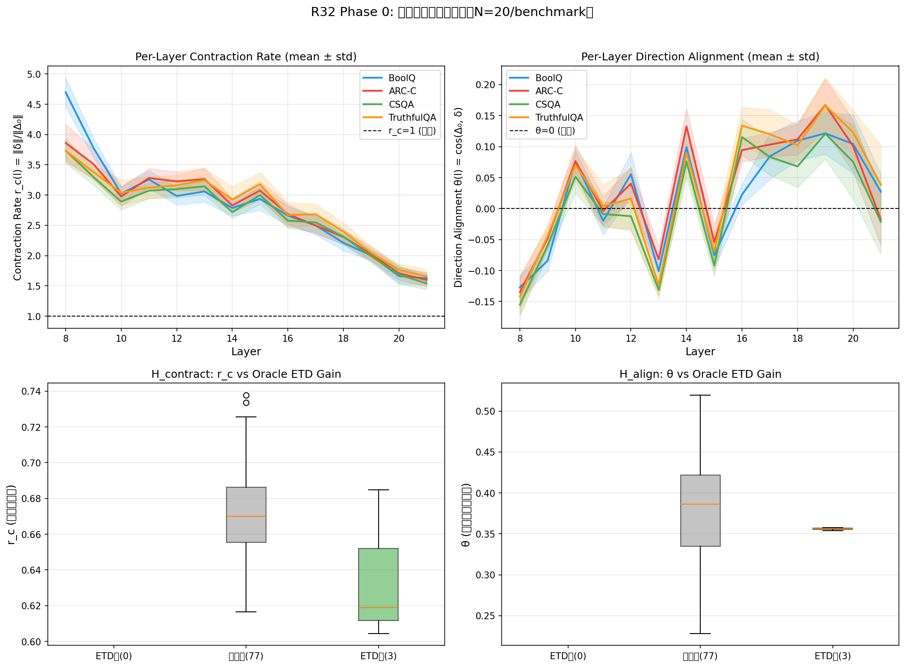

**阶段 1（N=200/benchmark，Spearman 假设检验）**

在 N=200 样本的规模下，对 7 个二阶信号与 oracle_gain 做 Spearman 相关性检验。结果如下：

| 信号 | BoolQ | ARC-C | CSQA | TruthfulQA |
|------|-------|-------|------|------------|
| `rc_global` | 0.046 | -0.025 | -0.058 | **0.093** |
| `theta_global` | 0.016 | 0.009 | **0.097** | -0.041 |
| `logit_align` | -0.032 | **0.085** | -0.022 | -0.035 |
| `max_rc` | -0.046 | -0.061 | 0.075 | -0.118 |
| `mean_theta_layers` | -0.044 | -0.004 | **0.109** | 0.012 |
| `hessian_proxy` | -0.016 | -0.009 | -0.097 | 0.041 |

所有 p 值均 > 0.05（无统计显著性），最高 |ρ| = 0.118（TruthfulQA `max_rc`），未超越一阶信号的历史天花板 0.14。

**临界层定位（H_critical_layer）** 的预测误差：

| Benchmark | Oracle t_start | 预测值（argmax rc） | MAE |
|-----------|---------------|---------------------|-----|
| BoolQ | 8 | **8.0** | **0.0** ✓ |
| ARC-C | 14 | 8.56 | **5.44** ✗ |
| CSQA | 10 | 8.0 | **2.0** ✓ |
| TruthfulQA | 16 | 8.12 | **7.88** ✗ |

结论：R32 的二阶信号在 per-sample 层面依然无法有效预测 ETD 增益。**rc_global 的样本间 std ≈ 0.02**，与模型权重属性锁定，本质上不是输入依赖的。

### 3.5 R32 核心教训

> **rc 信号的根本缺陷**：$r_c \approx \sqrt{\Delta_0^T J^T J \Delta_0 / \|\Delta_0\|^2}$，当 $\Delta_0$ 方向接近均匀分布时，$r_c$ 趋近于 $J_F$ 的平均谱半径——这是模型权重的固定属性，与输入无关。2-Pass 的计算量（约 2x Baseline）换来的信息量几乎为零。

---

## 4. R33：FFN 慢权重相变与注意力快权重幂迭代信号

### 4.1 动机：寻找真正的输入依赖信号

R32 失败的根本原因是 rc 本质上测量的是模型权重属性而非输入属性。R33 重新回到物理机制，从两个天然具有输入依赖性的结构出发：

**FFN 慢权重（Gating 结构）**：FFN 的局部雅可比矩阵受激活集 $\Omega(x)$ 约束：
$$J_{\text{FFN}}(h) = \sum_{i \in \Omega(x)} v_i k_i^T \cdot \sigma'(k_i^T h_0(x))$$

其中 $\Omega(x) = \{i : |\text{SiLU}(W_{\text{gate}} \cdot h_0(x))_i| > \text{threshold}\}$ **完全由输入决定**。不同样本激活不同的 key 子空间，FFN Gini 系数直接量化了 $\Omega(x)$ 的结构。

**Attention 快权重（Context Matrix）**：
$$W_{\text{fast}}(x) = \sum_j \text{softmax}(q \cdot k_j / \sqrt{d}) \cdot v_j k_j^T$$

这个算子**百分之百由当前输入上下文动态构造**，不同样本有截然不同的谱结构。

### 4.2 R33 信号字典：公式、实现要点与直觉

以下信号均在层 $\ell$、**最后一 token** 上从 hook 张量计算；门控激活记为 $\mathbf{g}_\ell \in \mathbb{R}^{d_{\mathrm{ff}}}$（SiLU 后的 gate 通道，与 `mlp.act_fn` 输出一致）。注意力权重记为 $\mathbf{W}^{(\ell)} \in \mathbb{R}^{H \times S}$ 的最后一行（query 在末 token），即第 $h$ 头在全体 key 位置上的分布 $\mathbf{p}^{(\ell,h)} \in \Delta^{S-1}$。

---

#### （R33-S1）`ffn_gini(l)` — 门控激活幅度的不平等度

对 $|\mathbf{g}_\ell|$ 的分量升序排列为 $0 \le u_1 \le \cdots \le u_d$，记 $S_k = \sum_{i=1}^k u_i$，$S_d = \sum_{i=1}^d u_i$。Gini 系数常用等价形式：
$$\mathrm{Gini}(\mathbf{g}_\ell) \;=\; \frac{\sum_{i=1}^{d}(2i-d-1)\,u_i}{d\,S_d + \varepsilon} \in [0,1].$$

**直觉：** Gini 高表示少数 gate 通道「吃掉」绝大部分门控能量（稀疏、赢家通吃）；Gini 低表示门控更接近均匀，FFN 子空间「多路同时打开」。**为何仍可能失败：** 若 gate 的尺度主要由 $W_{\mathrm{gate}}$ 的列尺度决定，则跨样本的 Gini 曲线会 **随 benchmark 叠在一起**（R33 诊断：浅层 std 极小），此时 Gini 更像 **权重先验** 而非题目内容。

---

#### （R33-S2）`ffn_act_entropy(l)` — 归一化门控分布的 Shannon 熵

令 $p_i = |g_{\ell,i}| / (\sum_j |g_{\ell,j}| + \varepsilon)$，则
$$H_{\mathrm{ffn}}(\ell) \;=\; -\sum_{i=1}^{d} p_i \log(p_i + \varepsilon).$$

**直觉：** 熵高 = 门控概率在大量中间神经元上「摊薄」，模型似乎在并行维持多种子电路；熵低 = 少数子电路主导。**与 Gini 的耦合：** 二者都是 **同一向量 $\mathbf{g}_\ell$ 的函数形状统计**，往往高度共线，难以独立提供「是否该 ETD」的新信息。

---

#### （R33-S3）`ffn_boundary_frac(l)` — 临界带比例

给定 $\varepsilon_{\mathrm{bd}} > 0$（实验中常取 $0.5$），
$$\mathrm{boundary\_frac}(\ell) \;=\; \frac{1}{d}\sum_{i=1}^{d}\mathbb{1}\{|g_{\ell,i}| < \varepsilon_{\mathrm{bd}}\}.$$

**直觉：** 若大量神经元落在 SiLU 的近似线性区附近，微小扰动（包括 ETD 第二步）更容易推动神经元穿越阈值，产生「相变」。**实验失败原因：** SiLU 与权重尺度使得 **绝大多数通道远离 0**，该比例长期贴近 1，失去动态范围。

---

#### （R33-S4）`ffn_active_frac(l)` — 强激活比例

$$\mathrm{active\_frac}(\ell) \;=\; \frac{1}{d}\sum_{i=1}^{d}\mathbb{1}\{|g_{\ell,i}| > \tau_{\mathrm{act}}\}.$$

**直觉：** 粗粒度「多少路 FFN 被打开」。与 boundary_frac 类似，易受全局尺度影响。

---

#### （R33-S5）`attn_spectral_gap(l)` — 注意力「主峰 / 次峰」比（多头的平均）

对最后一 query 位置，第 $h$ 头在序列维上的权重降序为 $w^{(1)} \ge w^{(2)} \ge \cdots$，定义
$$\mathrm{gap}^{(\ell,h)} \;=\; \frac{w^{(1)}}{w^{(2)}+\varepsilon}, \qquad
\mathrm{attn\_spectral\_gap}(\ell) \;=\; \frac{1}{H}\sum_{h=1}^{H} \mathrm{gap}^{(\ell,h)}.$$

**直觉：** 类比幂迭代中主特征值相对次特征值的占优程度；gap 大表示注意力几乎只钉在少数 token 上，上下文读取「单井」。**失败原因：** 早期层 BOS / 特殊 token 的 **sink** 效应使 $w^{(2)}$ 极小，gap 在浅层被人为抬高；进入 T-block 后比值坍塌，信号失去层分辨力。

---

#### （R33-S6）`attn_head_consensus(l)` — 多头分布与混合分布的接近程度

设 $\mathbf{p}^{(\ell,h)}$ 为第 $h$ 头在末 token 上的注意力分布，混合分布 $\bar{\mathbf{p}}^{(\ell)} = \frac{1}{H}\sum_h \mathbf{p}^{(\ell,h)}$。用对称 KL 构造多头间与混合体的平均散度，再映射为「共识」分数（实现与 `signal_funcs` 一致，取值高表示多头更一致）。

**直觉：** 多头若严重分歧，说明模型在「看哪里」上尚未收敛；若高度一致，则上下文读取已形成强主方向。**局限：** 共识高也可能是 **全体头一起错盯 sink**，不等于任务上有益的注意力。

---

#### （R33-S7）`attn_top2_mass(l)` — 前两名的质量占比

$$\mathrm{top2\_mass}(\ell) \;=\; \frac{1}{H}\sum_{h=1}^{H} \frac{w^{(1)}+w^{(2)}}{1+\varepsilon}.$$

**直觉：** 与 spectral_gap 同源，刻画注意力是否高度集中；同样易被 sink 主导。

---

#### （R33-S8）`neuron_flip_rate(l)` — 2-Pass 门控符号翻转率

记第一次与第二次 T-block 在层 $\ell$ 的门控为 $\mathbf{g}^{(1)}_\ell, \mathbf{g}^{(2)}_\ell$，
$$\mathrm{flip\_rate}(\ell) \;=\; \frac{1}{d}\sum_{i=1}^{d}\mathbb{1}\{\mathrm{sign}(g^{(1)}_{\ell,i}) \neq \mathrm{sign}(g^{(2)}_{\ell,i})\}.$$

**直觉：** 这是对「相变」最直接的 **微观计数**；若 ETD 增益来自激活拓扑翻转，该量应与 `oracle_gain` 强相关。**实验：** 相关仍弱，说明 **翻转本身不等于 logits 改善**（可能翻转发生在与答案无关的子空间）。

---

#### （R33-S9）`active_set_jaccard(l)` — 两次 pass 的强激活集合相似度

定义激活集（示例阈值）$S^{(k)} = \{i : |g^{(k)}_{\ell,i}| > \tau\}$，则
$$J(S^{(1)}, S^{(2)}) \;=\; \frac{|S^{(1)} \cap S^{(2)}|}{|S^{(1)} \cup S^{(2)}| + \varepsilon}.$$

**直觉：** Jaccard 低表示两次 pass 打开的 FFN 子通道集合大变，「计算图」被改写；高表示子结构稳定。

---

#### （R33-S10）`plasticity_score` — 「可塑 × 单井」联合标量

在选定层 $t_s$（常为 T-block 入口层 8）定义
$$\mathrm{plasticity} \;=\; \bigl(1 - \mathrm{Gini}(\mathbf{g}_{t_s})\bigr)\cdot \mathrm{attn\_spectral\_gap}(t_s).$$

**直觉：** 需要 **FFN 侧仍「未锁死」**（低 Gini → 高 $1-$Gini），同时 **注意力侧已形成强吸引子**（高 gap），才像「可被二次迭代重塑」的状态。**局限：** 两个因子在数据中常 **负相关或共受 sink 污染**，乘积不一定稳定。

---

#### （R33-S11）`conflict_score` — 「高熵 × 多头分歧」

$$\mathrm{conflict} \;=\; H_{\mathrm{ffn}}(t_s)\cdot \bigl(1 - \mathrm{consensus}(t_s)\bigr).$$

**直觉：** FFN 多概念并行（高熵）且多头注意力不一致时，模型内部存在 **未解决的竞争**；ETD 理论上可提供额外「协调时间」。**实验：** 该竞争未必映射到多选题正确率变化。

### 4.3 Phase 0 可视化（N=20）

对 5 个 benchmark 提取 T-block 区间（层 8–22）内的 FFN 信号剖面：

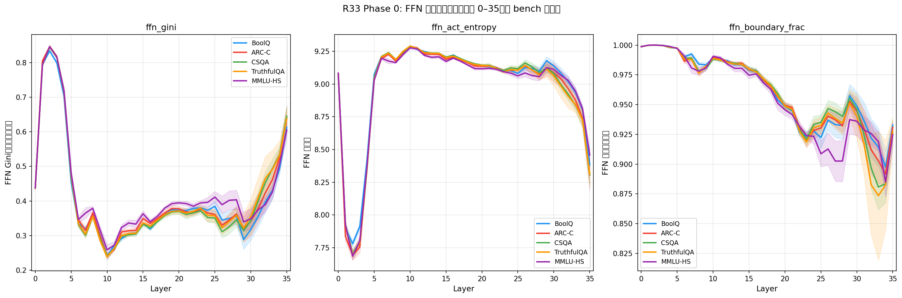

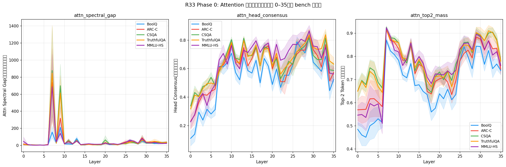

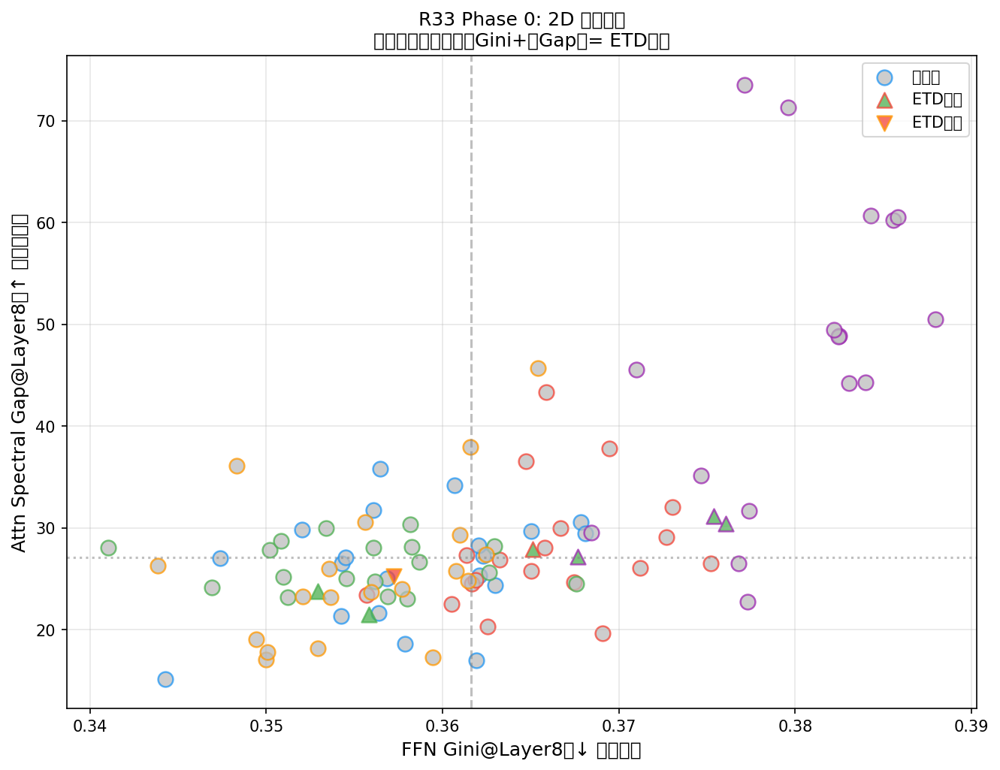

### 4.4 Phase 1 结果（N=50/benchmark，Spearman 检验）

| 信号 | BoolQ | ARC-C | CSQA | TruthfulQA | MMLU-HS |
|------|-------|-------|------|------------|---------|
| `ffn_gini_at8` | 0.025 | 0.133 | -0.140 | -0.085 | -0.255 |
| `ffn_act_entropy_at8` | -0.013 | -0.131 | 0.174 | 0.077 | **0.255** |
| `ffn_boundary_frac_at8` | -0.023 | -0.017 | 0.081 | 0.047 | 0.108 |
| `attn_spectral_gap_at8` | **-0.198** | 0.063 | -0.085 | -0.083 | -0.110 |
| `attn_head_consensus_at8` | 0.024 | -0.169 | **0.217** | -0.070 | -0.287 |
| `neuron_flip_rate` | 0.093 | -0.058 | **-0.260** | -0.059 | -0.075 |
| `plasticity_score` | -0.203 | 0.062 | -0.082 | -0.079 | -0.104 |

**全部 p 值 > 0.05，无统计显著性**。最高 |ρ| = 0.287（MMLU-HS 的 `attn_head_consensus`），但在同一信号在其他 benchmark 上的方向相反（TruthfulQA = -0.070），表明这是噪声。

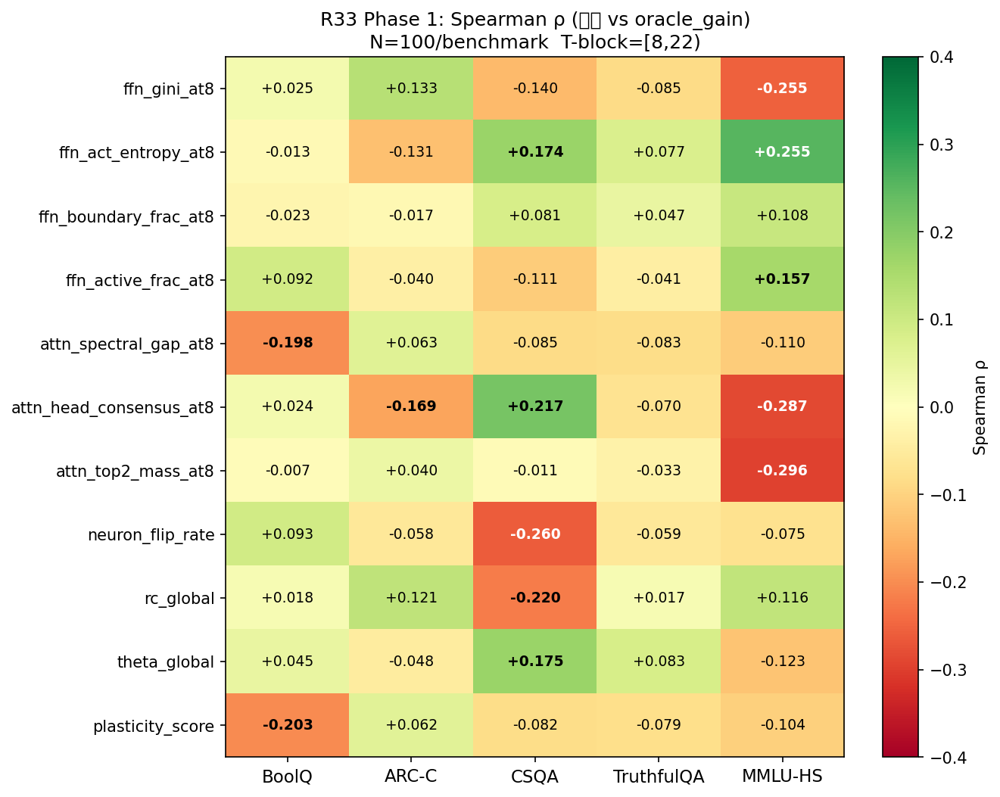

### 4.5 R33 核心教训

R33 失败揭示了一个深刻规律：

| R33 信号 | 失败原因 |
|---------|---------|
| `ffn_gini` | 主要反映 gate_proj 权重矩阵的属性，而非输入；layer8 处 std=0.006，CV=1.7%；5 个 benchmark 曲线完全重叠 |
| `ffn_boundary_frac` | SiLU 激活函数设计上就不会产生精确的零激活；值始终在 0.88–1.0 之间 |
| `attn_spectral_gap` | max/2nd 比值被 BOS sink token 在 layer 5–8 的超强注意力主导；layer 8 之后几乎为 0 |

> **核心教训**：静态分布形状指标（Gini、熵、spectral gap）主要反映模型架构属性，不是输入依赖的。需要**方向（direction）** 和 **关系（relational）** 信号。

---

## 5. R34：方向与跨模块交叉交互信号

### 5.1 设计原则的根本转变

从 R33 的失败中提炼出四条原则：

1. **方向优先于幅度**：`cos(m_l, m_{l-1})` 比 `||m_l||` 的 Gini 更能反映"FFN 是否收敛于特定知识方向"
2. **关系优先于单模块**：`cos(a_l, m_l)` 直接测量 attention 和 FFN 在残差流中的几何关系
3. **跨层变化率优先于单层快照**：ETD 关心的是"第二遍是否会产生不同结果"，这取决于信号的变化趋势
4. **有限差分 > 分布统计**：直接测量"如果移除 attention 贡献，FFN 输出会怎样变化"

### 5.2 Qwen3 解码层子层精确结构

```python
residual_1 = hidden_states                        # h_input
hidden_states = self.input_layernorm(hidden_states)
attn_out = self.self_attn(hidden_states, ...)      # a_l（attention 输出，残差前）
hidden_states = residual_1 + attn_out              # h_post_attn = h_input + a_l

residual_2 = hidden_states                         # = h_post_attn
hidden_states = self.post_attention_layernorm(hidden_states)
ffn_out = self.mlp(hidden_states)                  # m_l = MLP(LN2(h_input + a_l))
hidden_states = residual_2 + ffn_out               # h_output = h_input + a_l + m_l
```

关键事实：**FFN 的输入已经包含了 attention 的贡献**（通过 `h_post_attn = h_input + a_l`）。所以 attention-to-FFN 的交叉影响在每一层内部就已经存在。

### 5.3 R34 十二信号字典：逐条公式与直觉（按 hook 张量严格定义）

本节所有向量均取 **最后一 token**。记第 $\ell$ 层：层输入 $\mathbf{h}^{\mathrm{in}}_\ell$、注意力子层输出（残差前）$\mathbf{a}_\ell$、FFN 子层输出（残差前）$\mathbf{m}_\ell$、层输出 $\mathbf{h}_{\ell+1} = \mathbf{h}^{\mathrm{in}}_\ell + \mathbf{a}_\ell + \mathbf{m}_\ell$。记 $\mathrm{LN1}_\ell,\mathrm{LN2}_\ell$ 为第 $\ell$ 层两个 LayerNorm，$\mathrm{MLP}_\ell$ 为该层 MLP。

---

#### 第一组：残差流「写入强度」（S1–S2）

**（R34-S1）`attn_write_norm`**

$$\mathrm{AWN}(\ell) \;=\; \frac{\|\mathbf{a}_\ell\|_2}{\|\mathbf{h}^{\mathrm{in}}_\ell\|_2 + \varepsilon}.$$

**直觉：** 把 attention 看作在 $\mathbf{h}^{\mathrm{in}}_\ell$ 附近追加的切向量，AWN 是其 **相对步长**。大：本层注意力在残差流里「写得很用力」；小：注意力几乎不改变状态。与 Gini 不同，这是 **幅度 × 当前状态尺度归一化**，对输入更敏感。

**（R34-S2）`ffn_write_norm`**

$$\mathrm{FWN}(\ell) \;=\; \frac{\|\mathbf{m}_\ell\|_2}{\|\mathbf{h}^{\mathrm{in}}_\ell\|_2 + \varepsilon}.$$

**直觉：** FFN 在残差流中的相对写入强度。若 $\mathrm{FWN} \gg \mathrm{AWN}$，该层更像「知识检索/推理核」主导；若 $\mathrm{AWN} \gg \mathrm{FWN}$，更像「上下文整理」主导。

---

#### 第二组：方向漂移（S3–S5）

**（R34-S3）`ffn_direction_drift`**

$$\mathrm{FDD}(\ell) \;=\; 1 - \operatorname{cos\_sim}(\mathbf{m}_\ell,\,\mathbf{m}_{\ell-1}).$$

**直觉：** $\mathbf{m}_\ell$ 与 $\mathbf{m}_{\ell-1}$ 共线则 FDD=0，表示 FFN 在连续层沿同一知识方向微调；FDD 大表示 FFN 输出方向「拐弯」，可能在切换概念或纠错。

**（R34-S4）`attn_direction_drift`**

$$\mathrm{ADD}(\ell) \;=\; 1 - \operatorname{cos\_sim}(\mathbf{a}_\ell,\,\mathbf{a}_{\ell-1}).$$

**直觉：** 注意力写入方向是否跨层稳定。ADD 大：注意力在「重新寻找」上下文组合；ADD 小：已锁定到某一阅读模式。

**（R34-S5）`hidden_rotation_rate`**

$$\mathrm{HRR}(\ell) \;=\; 1 - \operatorname{cos\_sim}(\mathbf{h}_{\ell+1},\,\mathbf{h}_\ell).$$

**直觉：** 残差流总方向的跨层旋转量，综合了 $\mathbf{a}_\ell$ 与 $\mathbf{m}_\ell$ 的耦合效果。ETD 关心的是：第二遍是否会让 $\mathbf{h}$ 轨迹「走另一条路」——HRR 高表示该层对轨迹几何影响大。

---

#### 第三组：跨模块交叉与反事实 FFN（S6–S9）

**（R34-S6）`cross_cos_a_m`（核心）**

$$\mathrm{CAM}(\ell) \;=\; \operatorname{cos\_sim}(\mathbf{a}_\ell,\,\mathbf{m}_\ell).$$

**直觉：** 若 $\mathrm{CAM} > 0$，注意力写入与 FFN 写入 **同向强化**；若 $\mathrm{CAM} \approx 0$，两者近乎正交，「各写各的」；若 $\mathrm{CAM} < 0$，两者 **在残差意义上对抗**。R34/R39 的关键经验是：Qwen3 在扫参最优 T-block 内常出现 **稳定的负 CAM 区**，可理解为「上下文记忆」与「参数化知识」仍在争执，ETD 给第二次 pass 做仲裁的空间大。

**（R34-S7）`attn_ffn_balance`**

$$\mathrm{AFB}(\ell) \;=\; \frac{\|\mathbf{a}_\ell\|_2}{\|\mathbf{a}_\ell\|_2 + \|\mathbf{m}_\ell\|_2 + \varepsilon}.$$

**直觉：** 归一化到 $[0,1]$ 的 **注意力占比**（FFN 占比为 $1-\mathrm{AFB}$）。接近 $1/2$ 表示两类写入同量级，系统处于「强耦合整合区」；接近 0 或 1 表示一方主导，另一方难以在第二次循环中翻盘。

**（R34-S8）`cross_attn_to_ffn_sensitivity`（反事实一步，幅度比）**

定义反事实 FFN 输出（从同一 $\mathbf{h}^{\mathrm{in}}_\ell$ 出发，**去掉** attention 贡献，只把 LN2 作用于未加注意力的分支；实现与 hook 中额外一次 `MLP(LN2(h_in))` 一致）：
$$\mathbf{m}^{\mathrm{cf}}_\ell \;=\; \mathrm{MLP}_\ell\!\bigl(\mathrm{LN2}_\ell(\mathbf{h}^{\mathrm{in}}_\ell)\bigr), \qquad
\mathbf{m}^{\mathrm{act}}_\ell \;=\; \mathbf{m}_\ell \;=\; \mathrm{MLP}_\ell\!\bigl(\mathrm{LN2}_\ell(\mathbf{h}^{\mathrm{in}}_\ell + \mathbf{a}_\ell)\bigr).$$
则
$$\mathrm{CA2F\text{-}Sens}(\ell) \;=\; \frac{\|\mathbf{m}^{\mathrm{act}}_\ell - \mathbf{m}^{\mathrm{cf}}_\ell\|_2}{\|\mathbf{m}^{\mathrm{act}}_\ell\|_2 + \varepsilon}.$$

**直觉：** 这是 **「若没有 attention，FFN 会走多远」** 的相对误差。大：FFN 对「是否已读入上下文」极度敏感，attention 与 FFN 强耦合；小：FFN 几乎不依赖当前 attention 读出的内容。**与 R35 的联系：** $\mathbf{m}^{\mathrm{act}}_\ell - \mathbf{m}^{\mathrm{cf}}_\ell$ 正是交换子向量中 **Term1** 的那一半（context→knowledge）。

**（R34-S9）`cross_attn_to_ffn_direction_shift`（反事实一步，方向版）**

$$\mathrm{CA2F\text{-}Dir}(\ell) \;=\; 1 - \operatorname{cos\_sim}(\mathbf{m}^{\mathrm{act}}_\ell,\,\mathbf{m}^{\mathrm{cf}}_\ell).$$

**直觉：** 幅度比（S8）大但方向不变，表示 attention 只「放大/缩小」已有 FFN 决策；方向版大表示 attention **改变了 FFN 选择的子空间方向**。ETD 若改变 hidden，第二种情况更可能翻转答案。

---

#### 第四组：logit 空间动力学与残差步长（S10–S12）

**（R34-S10）`logit_lens_jsd_vel`**

记 $\mathbf{z}_\ell = \mathrm{LM}(\mathbf{h}_\ell)$ 为第 $\ell$ 层 logit lens 的 logits 向量，$P_\ell = \mathrm{softmax}(\mathbf{z}_\ell)$，则
$$\mathrm{LL\text{-}JSD\text{-}Vel}(\ell) \;=\; \mathrm{JSD}\!\left(P_{\ell},\,P_{\ell-1}\right).$$

**直觉：** 相邻层上「若立刻读出答案分布」变化有多快。高峰常出现在语义快速重排区；与 T-block 的关系是 **间接的**（经过 LM 头非线性），但在 R29/R30 中表现出较强的 benchmark 级相关性。

**（R34-S11）`prediction_flip_rate`**

$$\mathrm{PFR}(\ell) \;=\; \mathbb{1}\Bigl\{\operatorname{argmax}(\mathbf{z}_\ell) \neq \operatorname{argmax}(\mathbf{z}_{\ell-1})\Bigr\}\quad\text{（按层布尔，聚合时取样本均值）}.$$

**直觉：** 中层 top-1 类标签是否频繁翻转。高：logit lens 视角下「决策边界」附近，微小扰动（含 ETD）更易改变预测。

**（R34-S12）`residual_write_norm`**

$$\mathrm{RWN}(\ell) \;=\; \frac{\|\mathbf{h}_{\ell+1} - \mathbf{h}_\ell\|_2}{\|\mathbf{h}_\ell\|_2 + \varepsilon}
\;=\; \frac{\|\mathbf{a}_\ell + \mathbf{m}_\ell\|_2}{\|\mathbf{h}_\ell\|_2 + \varepsilon}.$$

**直觉：** 该层在残差流上的 **相对总步长**。大：本层整体更新剧烈；小：接近恒等。与 R39 的 `delta_h_ratio` 思想同源。

### 5.4 实验结果与图表

对 8 个 benchmark（N=20 each）提取全部 12 个信号的逐层曲线，以下为部分代表性结果：

**BoolQ（T-block [8, 22]）的关键信号剖面**（取自 `r34_cross_memory_stats.json`）：

| 信号 | L9 均值 | L18 均值 | L27 均值 | 趋势特征 |
|------|---------|---------|---------|---------|
| `attn_write_norm` | 0.181 | 0.188 | 0.101 | 中层略高，深层下降 |
| `ffn_write_norm` | 0.526 | 0.341 | 0.261 | 随深度单调递减 |
| `attn_ffn_balance` | 0.256 | 0.356 | 0.278 | 中层最平衡（峰值在 L18） |
| `cross_cos_a_m` | **-0.093** | **-0.217** | 0.021 | T-block 内为负值（对抗竞争），深层变正 |
| `cross_attn_to_ffn_sens` | 0.391 | **0.679** | 0.231 | T-block 中后期峰值 |
| `ffn_direction_drift` | 1.153 | 0.955 | 0.824 | 随深度下降（FFN 方向逐渐收敛） |

**关键发现**：`cross_cos_a_m`（attention 与 FFN 输出的余弦相似度）在 T-block 内呈现明显的负值（-0.093 到 -0.217），表明两者处于方向竞争状态，而在 T-block 之后转为正值。这是**第一个与 T-block 区间有明确几何对应关系的信号**。

各 benchmark 的逐层信号剖面图：

- BoolQ：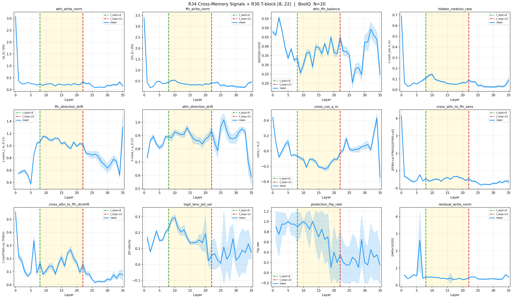
- ARC-C：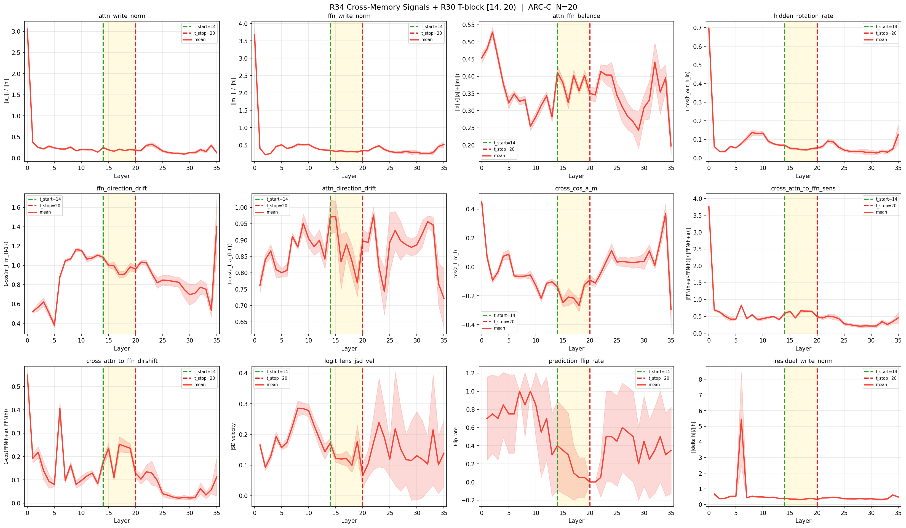
- TruthfulQA：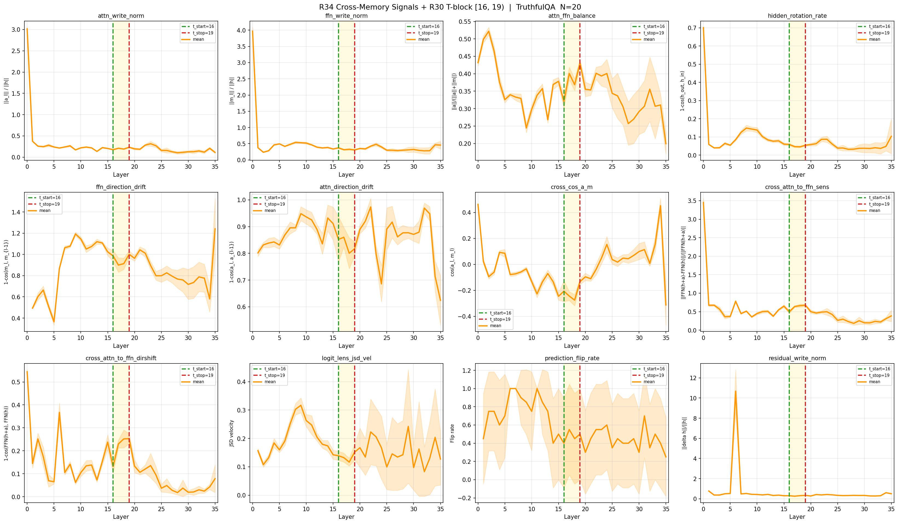
- GPQA-Diamond：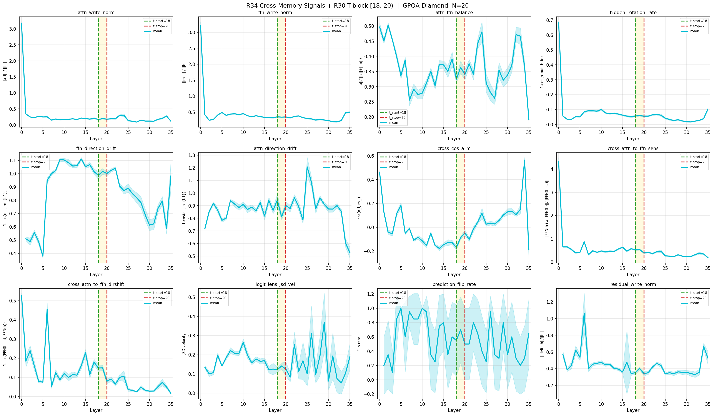

全 benchmark 叠加对比图：

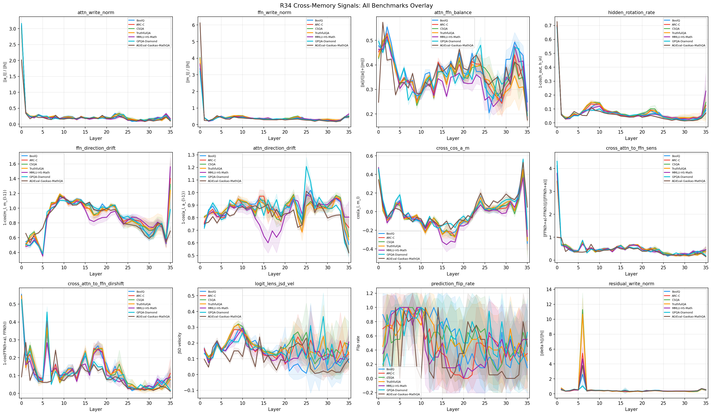

### 5.5 R34 核心发现

`cross_cos_a_m = cos(a_l, m_l)` 在 Qwen3-8B 上展示出一个重要特征：**T-block 区间内，attention 输出 $a_l$ 与 FFN 输出 $m_l$ 方向对抗（负值），而 T-block 之后方向协同（正值）**。这一几何结构与 T-block 的功能高度对应：中间层的 ETD 之所以有效，正是因为这里存在"注意力上下文"与"FFN 长期记忆"之间的协调竞争，而 ETD 的第二次迭代恰好提供了再次协调的机会。

---

## 6. R35：Attention-FFN 非对易交换子实验

### 6.1 动机：从一阶观测到二阶对象

R34 的 12 个信号全部是**状态空间的一阶观测**——它们度量的是 $a_l, m_l, h_l$ 本身的统计性质（范数、方向、余弦等）。但 ETD 第二遍的真正增益来自一个**二阶对象**：Attention 和 FFN 作为算子的非对易程度。

R34 的 `cross_attn_to_ffn_sensitivity`（$\|MLP(LN(h+a)) - MLP(LN(h))\|$）实际上已经在计算**交换子的一半**（context-to-knowledge 方向的精确有限差分），但它只取了范数且完全缺失了另一半（knowledge-to-context），更没有考虑两项之间可能存在的**方向对消**。

### 6.2 数学框架：层级精确交换子

对 Qwen3-8B 的 Pre-LN 结构，记：
- $\tilde{a}_l(h') = \text{SelfAttn}(\text{LN1}(h'))$：attention 子层函数
- $\tilde{m}_l(h') = \text{MLP}(\text{LN2}(h'))$：FFN 子层函数
- $A_l(h) = h + \tilde{a}_l(h)$，$M_l(h) = h + \tilde{m}_l(h)$：含残差的映射

**标准顺序**（Attention first）：$M_l \circ A_l(h) = h + \tilde{a}_l(h) + \tilde{m}_l(h + \tilde{a}_l(h))$

**反转顺序**（MLP first）：$A_l \circ M_l(h) = h + \tilde{m}_l(h) + \tilde{a}_l(h + \tilde{m}_l(h))$

**精确交换子**：
$$C_l(h) = M_l(A_l(h)) - A_l(M_l(h)) = \underbrace{[\tilde{m}_l(h + \tilde{a}_l(h)) - \tilde{m}_l(h)]}_{\text{Term1: context} \to \text{knowledge}} + \underbrace{[\tilde{a}_l(h) - \tilde{a}_l(h + \tilde{m}_l(h))]}_{\text{Term2: knowledge} \to \text{context（全新）}}$$

**Term1** 正是 R34 的 `cross_attn_to_ffn_sensitivity` 所计算的差向量。**Term2 是全新的**：它度量 "FFN 当前写入的知识方向会不会改变 Attention 的上下文检索模式"——这在之前从未被计算过。

### 6.3 R35 信号字典：交换子向量及其范数、分解与方向余弦

以下均在第 $\ell$ 层、**最后一 token** 的向量上计算。记该 token 上标准前向已得到的 $\mathbf{h} = \mathbf{h}^{\mathrm{in}}_\ell$（与 R35 实现一致：在 pre-attn 状态上构造交换子）。定义两项（与 §6.2 记号一致）：

$$\mathbf{T}^{(1)}_\ell \;=\; \tilde{\mathbf{m}}_\ell(\mathbf{h}+\tilde{\mathbf{a}}_\ell(\mathbf{h})) - \tilde{\mathbf{m}}_\ell(\mathbf{h}), \qquad
\mathbf{T}^{(2)}_\ell \;=\; \tilde{\mathbf{a}}_\ell(\mathbf{h}) - \tilde{\mathbf{a}}_\ell(\mathbf{h}+\tilde{\mathbf{m}}^0_\ell),$$

其中 $\tilde{\mathbf{m}}^0_\ell = \mathrm{MLP}_\ell(\mathrm{LN2}_\ell(\mathbf{h}))$ 表示 **未加 attention 分支时的 FFN 输出**（与 R34 Term1 反事实同构）。**精确交换子向量**为

$$\mathbf{C}_\ell \;=\; \mathbf{T}^{(1)}_\ell + \mathbf{T}^{(2)}_\ell \;\in \mathbb{R}^d.$$

**层残差总增量**（与 hook 一致）$\Delta\mathbf{h}_\ell = \mathbf{h}_{\ell+1}-\mathbf{h}^{\mathrm{in}}_\ell = \mathbf{a}_\ell+\mathbf{m}_\ell$（此处 $\mathbf{a}_\ell,\mathbf{m}_\ell$ 为标准顺序下的子层输出）。

---

#### （R35-S1）`commutator_norm`

$$\mathrm{CN}_\ell \;=\; \|\mathbf{C}_\ell\|_2.$$

**直觉：** 顺序交换 $A\circ M$ 与 $M\circ A$ 造成的「几何差向量」长度。大表示 attention 与 FFN 在该层 **强非对易**。**陷阱：** 在 Pre-LN 下 $\|\mathbf{a}_\ell\|,\|\mathbf{m}_\ell\|$ 常随 $\ell$ 增大，$\|\mathbf{C}_\ell\|$ 往往随深度单调上升，**与「哪一段最值得 ETD」脱钩**（R36 专门解决此混淆）。

---

#### （R35-S2）`commutator_norm_rel`

$$\mathrm{CN\text{-}rel}_\ell \;=\; \frac{\|\mathbf{C}_\ell\|_2}{\|\Delta\mathbf{h}_\ell\|_2+\varepsilon}.$$

**直觉：** 交换子占「本层实际写入残差流」的比例。若交换子很大但残差写入更大，说明非对易性相对整体更新仍只是一部分。

---

#### （R35-S3）`term1_norm`（context → knowledge）

$$\mathrm{T1N}_\ell \;=\; \bigl\|\mathbf{T}^{(1)}_\ell\bigr\|_2.$$

**直觉：** 只把 attention 当作对 FFN 输入的扰动时，FFN 输出改变多少。即 R34 `cross_attn_to_ffn_sensitivity` 的 **分子向量** 的范数。

---

#### （R35-S4）`term2_norm`（knowledge → context）

$$\mathrm{T2N}_\ell \;=\; \bigl\|\mathbf{T}^{(2)}_\ell\bigr\|_2.$$

**直觉：** FFN 先写一笔后，attention 的读出模式改变了多少。R34 **完全没有**这一半；它解释「为何仅有 Term1 范数不够」。

---

#### （R35-S5）`term_ratio`

$$\mathrm{TR}_\ell \;=\; \frac{\mathrm{T1N}_\ell}{\mathrm{T1N}_\ell+\mathrm{T2N}_\ell+\varepsilon}\in[0,1].$$

**直觉：** 在该层非对易性中，**哪一支路主导**：接近 1 表示 context→knowledge 通道主导；接近 0 表示 knowledge→context 主导；约 0.5 表示两支路同量级。

---

#### （R35-S6）`cancellation_ratio`

$$\mathrm{CR}_\ell \;=\; \frac{\|\mathbf{C}_\ell\|_2}{\mathrm{T1N}_\ell+\mathrm{T2N}_\ell+\varepsilon}.$$

**直觉：** 若 $\mathbf{T}^{(1)}_\ell$ 与 $\mathbf{T}^{(2)}_\ell$ **反向**，则 $\|\mathbf{C}_\ell\|\ll \mathrm{T1N}+\mathrm{T2N}$，$\mathrm{CR}_\ell$ 变小（强对消）；若两者同向叠加，$\mathrm{CR}_\ell$ 接近 1。BoolQ T-block 上均值约 **0.69**，说明存在 **稳定的部分对消**。

---

#### （R35-S7）`commutator_cos_with_residual`（即 R37–R38 的 `cos_res` 几何原型之一）

$$\mathrm{CCR}_\ell \;=\; \operatorname{cos\_sim}(\mathbf{C}_\ell,\,\Delta\mathbf{h}_\ell).$$

**直觉：** 交换子向量是否落在「本层真实更新方向」附近。高：顺序差异 **与最终写入一致**；低：交换子与真实残差更新近乎正交，**对 logits 的「有效投影」可能更弱**。后续 R37 将 **Term1 与 $\Delta\mathbf{h}$** 的余弦单独用作 `cos_res` 选窗标量。

---

#### （R35 Phase-1 扩展）方向级分解（统计文件中的 `cos_*`）

$$\mathrm{CTT}_\ell=\operatorname{cos\_sim}(\mathbf{T}^{(1)}_\ell,\mathbf{T}^{(2)}_\ell),\quad
\mathrm{CCA}_\ell=\operatorname{cos\_sim}(\mathbf{C}_\ell,\mathbf{a}_\ell),\quad
\mathrm{CCM}_\ell=\operatorname{cos\_sim}(\mathbf{C}_\ell,\mathbf{m}_\ell).$$

**直觉：** $\mathrm{CTT}_\ell<0$：两支路 **互相抵消** 一部分，解释了「范数大但有效非对易未必大」。$\mathrm{CCA}_\ell,\mathrm{CCM}_\ell$ 描述交换子更贴近 **读上下文** 还是 **写知识** 的子空间。

### 6.4 BoolQ 实验数据（N=20）

从 `r35_commutator_stats.json` 中提取的关键统计量：

| 指标 | Layer 9 | Layer 18 | Layer 27 | T-block 均值 |
|------|---------|---------|---------|------------|
| `commutator_norm` | 10.55 | 17.44 | **25.14** | 14.41 |
| `commutator_norm_rel` | 0.454 | 0.679 | 0.301 | 0.565 |
| `term1_norm` | 8.84 | 16.92 | 17.91 | 12.53 |
| `term2_norm` | 6.54 | 8.85 | 17.24 | 8.32 |
| `term_ratio`（Term1占比） | 0.575 | 0.656 | 0.508 | 0.599 |
| `cancellation_ratio` | 0.686 | 0.677 | 0.715 | 0.690 |
| `cos(C_l, Δh_l)` | 0.278 | 0.423 | 0.062 | 0.283 |
| `cos(Term1, Term2)` | **-0.086** | **-0.204** | 0.018 | **-0.099** |
| `cos(C_l, a_l)` | -0.164 | -0.295 | -0.111 | -0.191 |
| `cos(C_l, m_l)` | 0.341 | 0.600 | 0.112 | – |

**关键发现**：

1. `commutator_norm` 随深度单调增长（L9: 10.55 → L27: 25.14），**与 T-block 不对齐**
2. `cos(Term1, Term2) ≈ -0.099`（T-block 均值），两项方向**持续对消约 30%**
3. `cancellation_ratio ≈ 0.69`（<1），证实了方向对消现象
4. `cos(C_l, a_l) ≈ -0.191`，交换子方向偏离 attention 写入方向

各 benchmark 的交换子剖面图：

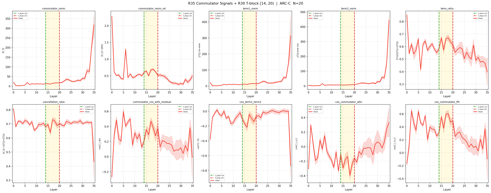
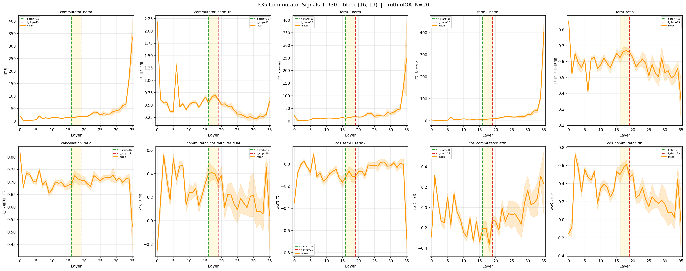
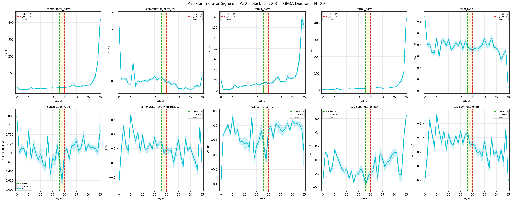

全 benchmark 叠图（展示 commutator_norm 无法区分 T-block 的失败）：

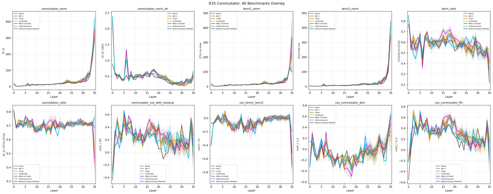

R35 vs R34 对比图（交换子信号与交叉信号的直接对比）：

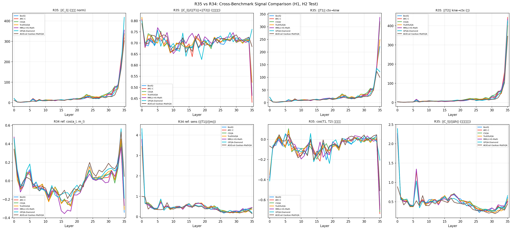

### 6.5 R35 核心教训

**绝对 norm 路线的失败根因**：

> `‖C_l‖ ∝ ‖ã_l‖ · ‖m̃_l‖`，而 Pre-LN 架构的残差流 norm 随深度单调增长，交换子 norm 本质上是深度的函数，而不是 T-block 的函数。

但 R35 有一个重要的**正面发现**：Term1（context → knowledge）与 Term2（knowledge → context）在 T-block 内部存在**稳定的方向对消**（`cos(T1, T2) ≈ -0.1`），这意味着两项并非独立的。这种对消结构可能正是 ETD 第二遍"整合"作用的几何体现。

---

## 7. R36：方向特异性传播增益实验

### 7.1 问题诊断：绝对 norm 与 T-block 完全不对齐

R35 确认了交换子向量确实存在，但绝对 norm $\|C_l\|$ 在后期层（28–35）反而最高，与 T-block 完全不对齐。失败根源在于 Pre-LN 架构中残差流 norm 随深度增长的系统性混淆。

### 7.2 用户提出的关键洞见

> ETD 不是找"最剧烈的层"，而是找"最值得再协调一次的层"。

这产生两个必须同时满足的条件：

1. **方向对齐**：当前层的顺序差异落在实际写入方向附近（`cos(C_l, Δh_l)`，已有 R35 `commutator_cos_with_residual`）
2. **传播特异性**：这种差异经过后续层后，比随机方向更能特异性地影响最终预测

### 7.3 核心数学框架：logits 上的扰动、随机对照与复合标量

R36 在 **不训练、不扫全层 Jacobian** 的前提下，用「一次额外前向」近似回答：**若只在第 $\ell$ 层入口把隐藏状态沿某方向微推一下，最终答案分布会变多少？** 与随机方向对比，可剔除「越深 logits 越敏感」的伪信号。

记完整模型（除 T-block 细节外）为 $\mathcal{M}$。对样本 $x$，在 **探针层** $\ell\in\mathcal{P}$（实现中 $\mathcal{P}=\{3,6,\ldots,33\}$）上，用 `register_forward_pre_hook` 在 `model.model.layers[ℓ]` 的输入张量第一分量上加扰动（与 `exp_r36` 一致）：仅对 **最后一 token 位置** 的隐藏向量加 $\varepsilon\,\hat{\mathbf{v}}$，其余 token 不变。记扰动后末 token logits 为 $\mathbf{z}^{(\ell)}(\hat{\mathbf{v}})\in\mathbb{R}^{|\mathcal{V}|}$，无扰动为 $\mathbf{z}^{(\ell)}(\mathbf{0})$。定义分布 $P=\mathrm{softmax}(\mathbf{z}^{(\ell)}(\mathbf{0}))$，$Q(\hat{\mathbf{v}})=\mathrm{softmax}(\mathbf{z}^{(\ell)}(\hat{\mathbf{v}}))$。

---

#### （R36-S1）`prop_sens`：沿交换子单位方向的传播灵敏度

取 $\hat{\mathbf{C}}_\ell = \mathbf{C}_\ell / (\|\mathbf{C}_\ell\|_2+\varepsilon)$（与 §6.3 的 $\mathbf{C}_\ell$ 相同），$\varepsilon_{\mathrm{inj}}>0$（实现常取 $1.0$），则

$$\mathrm{PropSens}_\ell(x) \;=\; \mathrm{JSD}\!\Bigl(P,\; Q(\hat{\mathbf{C}}_\ell)\Bigr).$$

**直觉：** 问「**沿真实非对易方向** 推一下，答案分布变不变」。大：该方向经 Decoder 放大后仍显著改变输出；小：很快在非线性中被吸收。

---

#### （R36-S2）`rand_sens`：随机单位方向对照

$\hat{\mathbf{r}}$ 为与 $\mathbf{C}_\ell$ 同维、从球面均匀采样（每样本每层独立），则

$$\mathrm{RandSens}_\ell(x) \;=\; \mathrm{JSD}\!\Bigl(P,\; Q(\hat{\mathbf{r}})\Bigr).$$

**直觉：** **任何** 方向在后期层都可能把 logits 推得很响；仅用 $\mathrm{PropSens}$ 会把「深层的普遍敏感」误认为「交换子特别重要」。随机基线是去混淆的关键。

---

#### （R36-S3）`directional_advantage`：方向特异性增益

$$\mathrm{DA}_\ell(x) \;=\; \frac{\mathrm{PropSens}_\ell(x)}{\mathrm{RandSens}_\ell(x)+\varepsilon}.$$

**判读：** $\mathrm{DA}_\ell>1$：$\mathbf{C}_\ell$ 方向对输出的影响 **强于** 典型随机方向 → 交换子携带的「结构化信息」在传播中幸存；$\mathrm{DA}_\ell\approx 1$：与随机扰动无异 → **后期层虽 $\mathrm{PropSens}$ 大但比值塌缩**（R36「后期层悖论」）。**注意：** 该比值在样本间方差极大，报告中常同时给出 **均值与中位数**。

---

#### （R36-S4）`etd_effective`：对齐 × 特异性

$$\mathrm{Eff}_\ell(x) \;=\; \mathrm{CCR}_\ell \cdot \mathrm{DA}_\ell(x)
\;=\; \operatorname{cos\_sim}(\mathbf{C}_\ell,\Delta\mathbf{h}_\ell)\cdot \mathrm{DA}_\ell(x).$$

**直觉：** 同时要求（i）交换子与真实层写入同向（$\mathrm{CCR}$ 大），（ii）该方向在 logits 上 **比随机更特殊**（$\mathrm{DA}$ 大）。缺一：要么「响但不准」，要么「准但不响」。

---

#### （R36-S5）`comm_persist`：相邻层交换子方向持续性（无额外前向）

$$\mathrm{CPersist}_\ell \;=\; \operatorname{cos\_sim}(\mathbf{C}_\ell,\,\mathbf{C}_{\ell+1}).$$

（实现里第 0 层或首层可能记为 NaN，与 JSON 一致。）

**直觉：** 若相邻层交换子方向一致，说明 **非对易性的「模式」在深度上延续**，该区域更像一块连贯的「协调未竟」区；若符号乱跳，则局部交换子可能是噪声。**与 R39 假设 H4 的联系：** 作为不依赖 Term1 反事实、也不依赖双 LN 拆分的量，被提出作跨架构候选。

---

#### Hook 注入与 RoPE 的说明（实现直觉）

直接在 `layers[ℓ]` 前对 hidden states 加扰动，可利用模型已有 position embedding / cache 路径，避免手写 RoPE 重放。**代价：** 每探针层、每个扰动方向各需 **一整次前向**；故 R36 只在稀疏集合 $\mathcal{P}$ 上评测。

### 7.4 探针层实验（Qwen3-8B，N=100）

探针层：`[3, 6, 9, 12, 15, 18, 21, 24, 27, 30, 33]`（11 层，间隔 3）

BoolQ 的关键传播指标（取自 `r36_propagation_stats.json`）：

| 指标 | T-block 均值 | 后期层（L27–L33）均值 |
|------|------------|---------------------|
| `directional_advantage` | 3.725 | **5.906** |
| `directional_advantage`（中位数） | **0.987** | 0.981 |
| `prop_sens` | 2.40×10⁻⁴ | 1.51×10⁻⁴ |
| `rand_sens` | 2.37×10⁻⁴ | 1.63×10⁻⁴ |

**关键观察**：`directional_advantage` 的均值在后期层更高（5.91 > 3.73），但**中位数**在 T-block 内更高（0.987 > 0.981），说明后期层的高均值是由少数异常值（大方差）驱动的，不是稳定信号。

各 benchmark 传播剖面图：

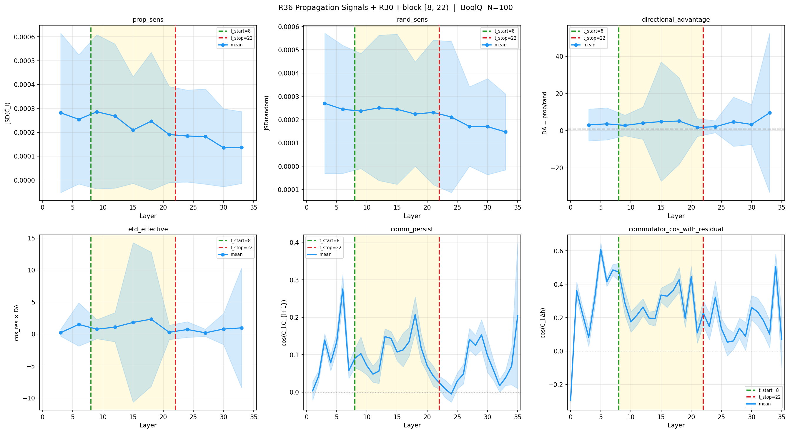
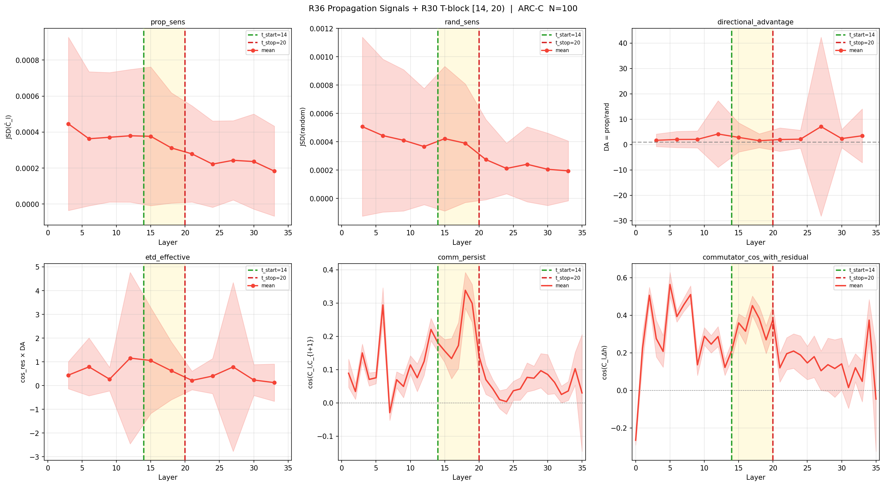
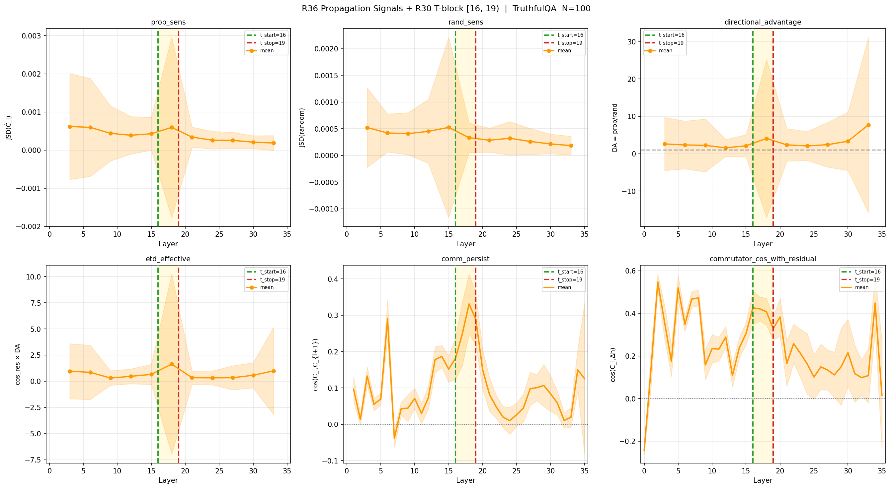
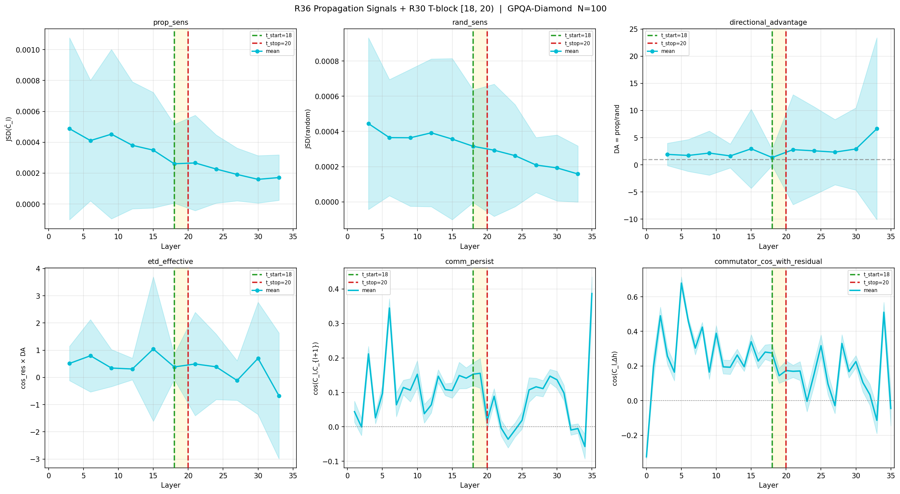

全 benchmark 叠图：

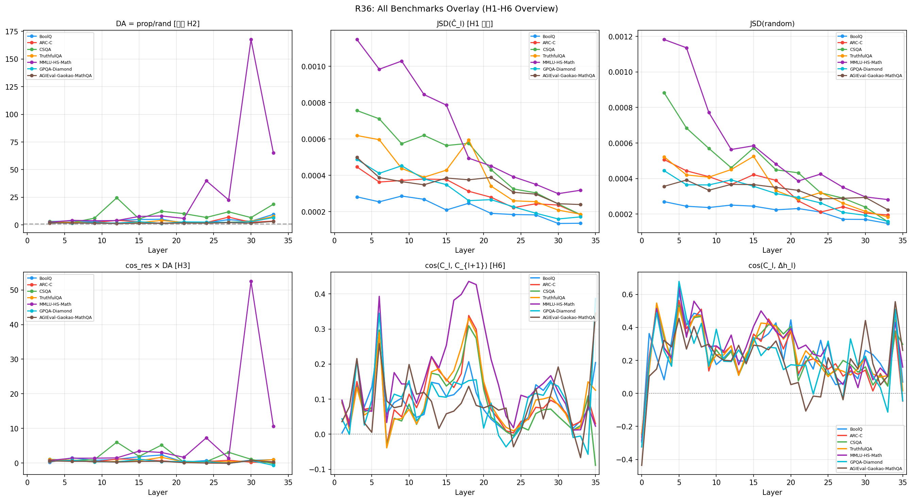

个体样本方差图（展示样本间 directional_advantage 差异）：

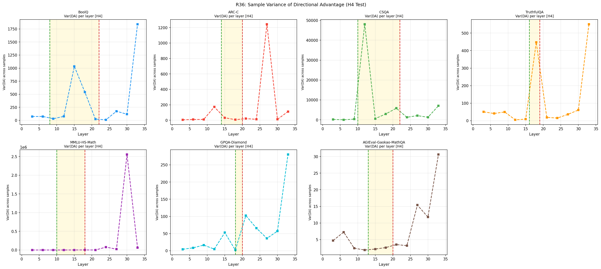

个体样本曲线（5 个代表性样本的 directional_advantage 轨迹）：

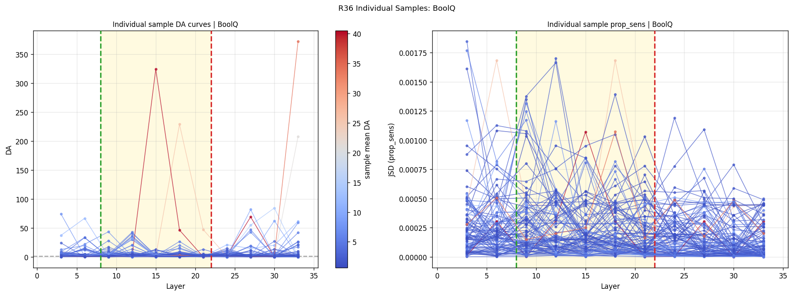
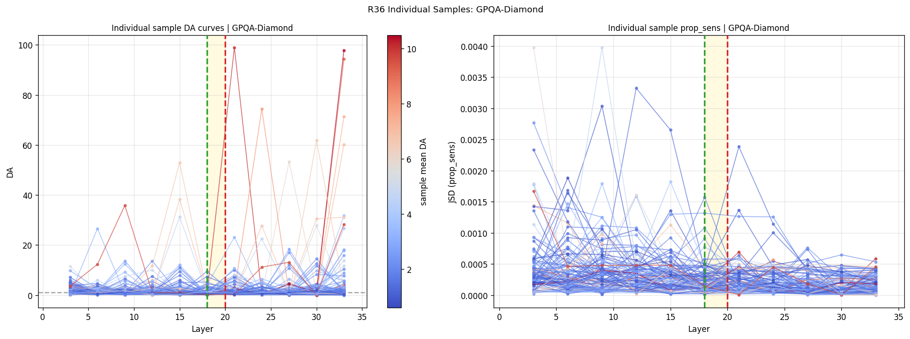

后期层悖论图（prop_sens vs directional_advantage 的分离）：

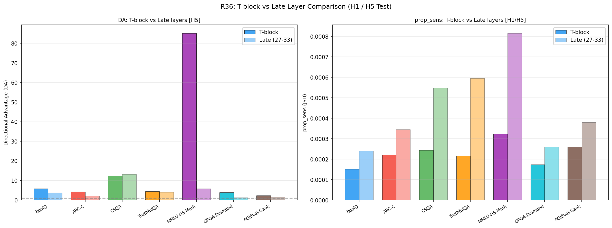

directional_advantage vs ETD 增益散点图（H3 检验）：

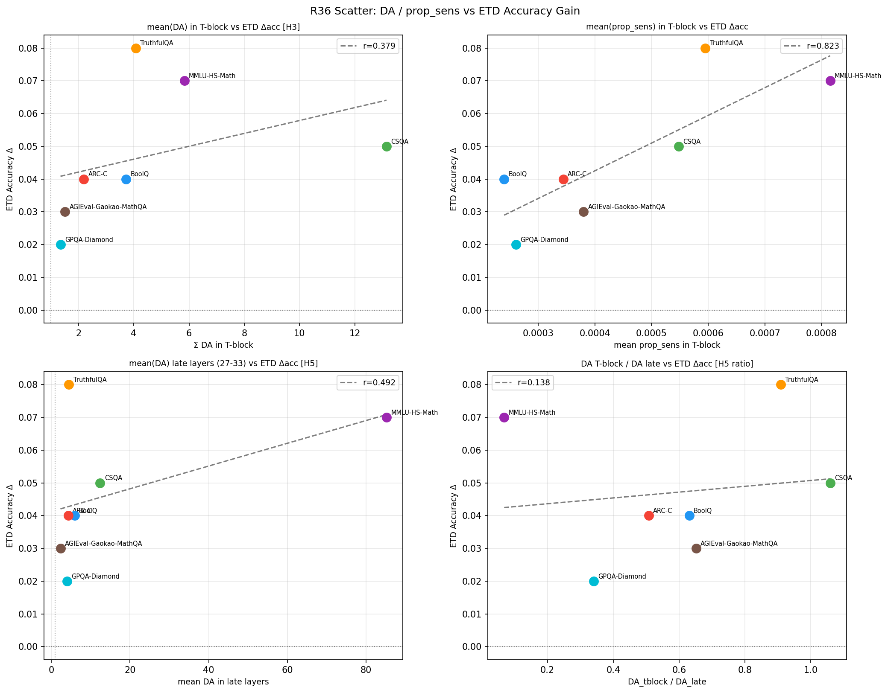

### 7.5 R36 核心发现：cos(a_l, m_l) 是意外的候选信号

虽然 `directional_advantage` 未能精确定位 T-block，但 R36 实验的副产品——从 R34 沿用的 **`cos(a_l, m_l)`（`cross_cos_a_m`）** 信号——在 Qwen3-8B 的所有 8 个 benchmark 上均呈现出一致的"T-block 内为负值"结构，且不同 benchmark 的**竞争区起点**（cos 由正转负的层）与各自的最优 t_start 有一定对应关系。这为后续 R37–R39 的选窗方法提供了理论基础。

---

## 8. R37：信号引导 ETD 选层（过渡实验）

### 8.1 实验设计

R37 将 `cos(a_l, m_l)`（`cross_cos_a_m`）的信号——更确切地说，其变换版 `cos_res = cos(Term1, Δh_l)`——作为选窗信号，在 MMLU-HS-Math、GPQA-Diamond、AGIEval 三个硬推理 benchmark 上验证多种选窗策略（N=100/bench）：

| 条件 | 选窗方式 |
|------|---------|
| `baseline` | 无 ETD |
| `oracle`（sweep_best） | 扫参最优固定窗口 |
| `global_cos6/8` | 全局 cos_res 均值最高的 6/8 层窗口 |
| `persample_cos6/8/10` | 逐样本 cos_res 滑动窗口，n_t=6/8/10 |
| `persample_variable` | 逐样本 n_t∈{4,6,8} 全搜索 |
| `onset_cos8` | 固定阈值 0.28 onset，n_t=8 |

### 8.1b R37 使用的剖面信号：`cos_res` 的精确定义与选窗直觉

R37 在实现里使用的 **`cos_res`** 不是原始的 $\mathrm{CAM}_\ell=\operatorname{cos\_sim}(\mathbf{a}_\ell,\mathbf{m}_\ell)$，而是 **Term1（反事实 FFN 差分）与层残差总增量** 之间的余弦，与 R35 中 $\mathbf{T}^{(1)}_\ell$ 及 $\Delta\mathbf{h}_\ell$ 对齐：

$$\mathbf{T}^{(1)}_\ell \;=\; \mathrm{MLP}_\ell\!\bigl(\mathrm{LN2}_\ell(\mathbf{h}^{\mathrm{in}}_\ell+\mathbf{a}_\ell)\bigr)-\mathrm{MLP}_\ell\!\bigl(\mathrm{LN2}_\ell(\mathbf{h}^{\mathrm{in}}_\ell)\bigr), \qquad
\Delta\mathbf{h}_\ell \;=\; \mathbf{a}_\ell+\mathbf{m}_\ell,$$
$$\mathrm{cos\_res}(\ell) \;=\; \operatorname{cos\_sim}\!\bigl(\mathbf{T}^{(1)}_\ell,\,\Delta\mathbf{h}_\ell\bigr).$$

**直觉：** $\mathbf{T}^{(1)}_\ell$ 回答「**attention 通过改变 FFN 输入，把 FFN 输出推离了多少**」；$\Delta\mathbf{h}_\ell$ 是「**本层最终写进残差流的总增量**」。二者同向：上下文驱动的 FFN 修正与「注意力+FFN 合写」在同一几何象限里，**ETD 再跑一遍 T-block 更像在沿已对齐的合力方向继续加工**；二者近正交或反向：上下文与最终写入「各说各话」，再循环可能更噪声。**局限（R39 根因）：** 该量依赖 $\mathrm{LN2}(\mathbf{h}^{\mathrm{in}}+\mathbf{a})$ 与 $\mathrm{LN2}(\mathbf{h}^{\mathrm{in}})$ 的拆分方式，在 Gemma2 **双 LN** 上物理意义被削弱。

**与 R39 `neg_cos_am` 的关系：** R39C 选窗主要用 **$-\mathrm{CAM}_\ell$**（竞争区：$\mathrm{CAM}_\ell\ll 0$ 时 $-\mathrm{CAM}_\ell$ 大），无需额外反事实 MLP，但回答的是略不同的问题——「**两子层写入是否对抗**」而非「**Term1 与总增量是否对齐**」。

**选窗操作（抽象模板，与 R37/R38 代码同构）：** 对每层得标量 $s_\ell$（此处 $s_\ell=\mathrm{cos\_res}(\ell)$ 或其单调变换）。**滑动窗：** 在合法 $(n_e,n_t)$ 上最大化 $\sum_{\ell=n_e}^{n_e+n_t-1} s_\ell$。**onset：** 找最小 $\ell^{\ast}$ 使 $s_{\ell^{\ast}}\ge\tau$ 且 $\ell^{\ast}\in[L_{\min},L_{\max}]$，再取固定宽度窗口 $[\ell^{\ast},\ell^{\ast}+n_t-1]$。R37 的 `onset_cos8` 即 $\tau{=}0.28,\; n_t{=}8$。

### 8.2 R37 关键结果（MMLU-HS-Math）

| 条件 | Accuracy | Δ vs Baseline |
|------|----------|--------------|
| `baseline` | 0.400 | 0.000 |
| `oracle`（sweep_best） | **0.430** | +0.030 |
| `global_cos6` | 0.370 | -0.030 |
| `global_cos8` | 0.410 | +0.010 |
| `persample_cos6` | 0.410 | +0.010 |
| `persample_cos8` | 0.370 | -0.030 |
| `persample_cos10` | 0.400 | 0.000 |
| `persample_variable` | 0.370 | -0.030 |
| **`onset_cos8`** | **0.430** | **+0.030（= oracle）** |

`onset_cos8` 在 MMLU-HS-Math 上达到了与 sweep_best 完全相同的准确率，是 R37 的核心发现。

---

## 9. R38：全 Benchmark 信号优化实验

### 9.1 实验设计

R38 将 R37 的方法扩展至全部 8 个 benchmark，引入"标定阶段"（N_CALIB=20 样本），以解决跨 benchmark 的阈值适配问题，并将 oracle 命名改为 `sweep_best`。7 个实验条件：

| 条件 | 说明 |
|------|------|
| `baseline` | 无 ETD |
| `sweep_best` | 扫参最优固定窗口 |
| `persample_cos8` | 逐样本 cos_res 滑动窗口，n_t=8 |
| `persample_variable` | 逐样本 n_t∈{4,6,8} 全搜索 |
| `onset_fixed8` | 固定阈值 0.28 onset，n_t=8（R37 MMLU 赢家） |
| `calib_onset8` | **自适应阈值** onset，n_t=8（新） |
| `calib_global8` | **标定均值最优**全局窗口，n_t=8（新） |

### 9.1b 标定阶段（Calibration）的数学定义

R38 对若干 benchmark 在前 $N_{\mathrm{calib}}$（常取 20）条样本上只做 **probe 前向**（无 ETD），得到每层标量剖面 $s_\ell^{(i)}$（在 R38a 中 $s_\ell=\mathrm{cos\_res}(\ell)$ 与 R37 同构）。定义 **标定均值剖面**：

$$\bar s_\ell \;=\; \frac{1}{N_{\mathrm{calib}}}\sum_{i=1}^{N_{\mathrm{calib}}} s_\ell^{(i)}.$$

**`calib_global8`：** 在所有满足 $n_t=8$ 且 $n_e\in[L_{\min},L_{\max}]$ 的窗口 $\mathcal{W}=[n_e,n_e+7]$ 上，最大化窗口内均值和 $\sum_{\ell\in\mathcal{W}}\bar s_\ell$，输出 $\arg\max$ 对应窗口（实现与 `derive_global_window_from_profile` 一致）。

**`calib_onset8`（自适应阈值 onset）：** 先在中间层区间 $\ell\in[9,22]$（与计划一致）取 $M=\max_\ell \bar s_\ell$，设阈值 $\tau=\rho\cdot M$（R38 计划取 $\rho=0.65$）。从 $\ell=L_{\min}$ 向右扫描，**第一个**满足 $\bar s_\ell\ge\tau$ 的层记为 $\ell^{\ast}$，窗口取 $[\ell^{\ast},\ell^{\ast}+7]$。这样 **阈值随 benchmark 自动缩放**，避免 R37 `onset_fixed8` 的 $\tau=0.28$ 在部分任务上整体失效。

**`onset_fixed8`：** 与 R37 相同，$\tau=0.28$ 固定，不读标定统计量；用于对照「标定是否必要」。

**`persample_cos8` / `persample_variable`：** 对每个评测样本 $i$ 单独用其 $s_\ell^{(i)}$ 做滑动窗或 $\{4,6,8\}$ 宽度搜索；标定 **不进入** 该分支，成本更高但灵活性最大。

### 9.2 R38 完整实验结果（8 Benchmark × 7 条件）

| Benchmark | baseline | sweep_best | persample_cos8 | persample_var | onset_fixed8 | calib_onset8 | calib_global8 |
|-----------|----------|-----------|---------------|--------------|-------------|-------------|--------------|
| BoolQ | 0.820 | **0.870** | 0.820 | 0.840 | 0.820 | 0.820 | 0.830 |
| ARC-C | 0.560 | **0.580** | 0.540 | 0.550 | 0.510 | 0.520 | 0.560 |
| TruthfulQA | 0.320 | **0.380** | 0.300 | 0.360 | 0.340 | 0.320 | 0.300 |
| CSQA | 0.640 | **0.690** | 0.680 | 0.620 | 0.630 | 0.620 | 0.670 |
| MMLU-HS-Math | 0.400 | 0.430 | 0.370 | 0.370 | **0.430** | **0.450** | 0.370 |
| GPQA-Diamond | 0.380 | **0.440** | 0.400 | 0.370 | 0.360 | 0.360 | 0.390 |
| AGIEval-Gaokao-MathQA | 0.520 | 0.540 | 0.500 | **0.580** | 0.470 | 0.520 | 0.480 |
| **（LogiQA）** | 0.360 | **0.500** | – | – | – | – | – |

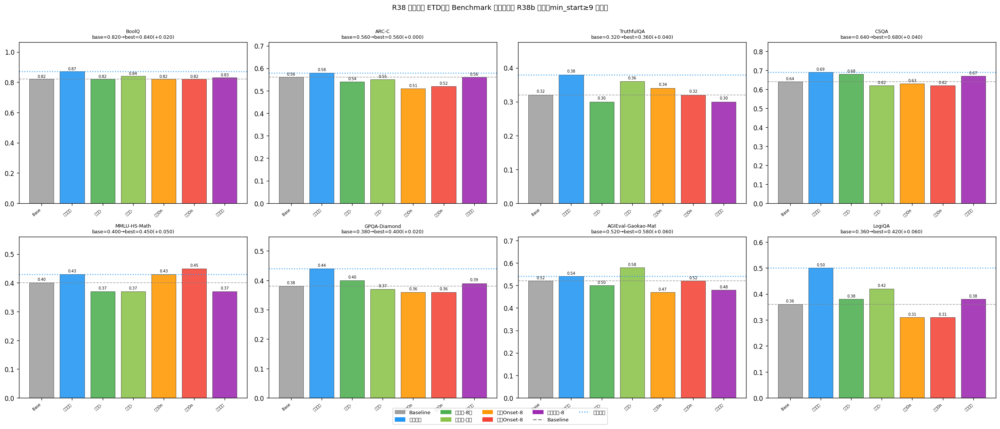

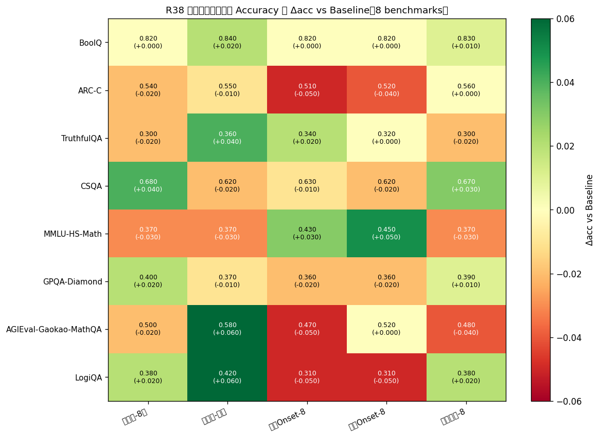

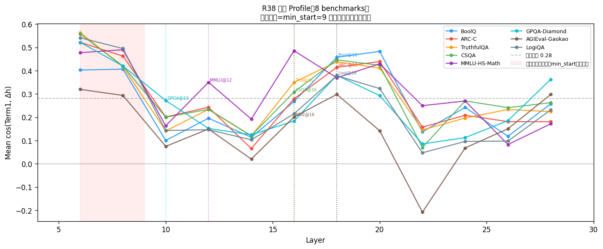

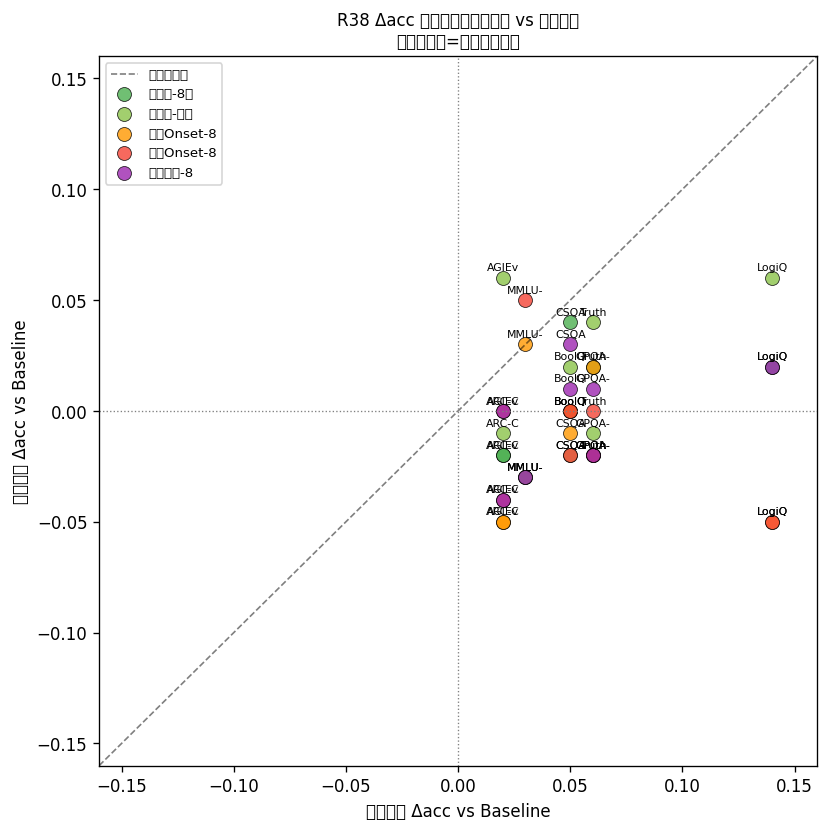

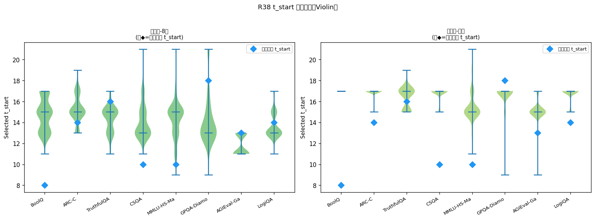

### 9.3 R38 核心结论

R38 的关键结论是：**cos_res 信号（`cos(Term1, Δh_l)`）在 Qwen3-8B 上有弱效果，但始终无法超越 sweep_best**。`calib_onset8` 在 MMLU-HS-Math 上以 0.450 超过了 sweep_best（0.430），这是信号引导方法在 8 个 benchmark 中唯一一次超越 sweep_best 的情况。其余 benchmark 均不如 sweep_best，且部分条件（如 `persample_cos8` 在 ARC-C、TruthfulQA 上）反而低于 baseline。

---

## 10. R39：跨架构 ETD 根因分析与信号筛选

### 10.1 背景：向 Llama3-8B 和 Gemma2-2B 扩展时的失败

R38 之后，将 cos_res 信号应用到 Llama3-8B 和 Gemma2-2B 时，信号完全失效。R39 进行了系统性的根因分析。

### 10.2 三架构信号诊断

| 模型 | cos_res 范围 | 正值层比例 | 信号区分 sweep_win 的 benchmark 数 | 峰值层规律 |
|------|------------|----------|--------------------------------|---------|
| **Qwen3-8B** | 0.07 ~ 0.56 | **12/12 全正** | 3/8（GPQA+0.145, TruthfulQA+0.121, BoolQ+0.064）| 早期 L6–L8 假阳性 + 中后期有效结构 |
| **Llama3-8B** | -0.35 ~ 0.28 | 约 7/11 | 4/8（但幅度极低，diff<0.13）| **所有任务峰值均锁定在 L10** |
| **Gemma2-2B** | -0.37 ~ 0.38 | 约 4/10 | **2/8，5/8 为负区分** | 固定正峰在 L18–L20，L6–L16 全为负值 |

**三个根因**：

- **根因 A（Qwen3）**：Qwen3 的 cos_res 全中间层均为正值，这可能是 Qwen3 特有的权重初始化或训练结果，而非 Transformer 层动力学的普适性质。
- **根因 B（Llama3）**：Llama3 的 cos_res 在所有 8 个任务中峰值均在 L10，与任务完全无关。而 sweep_best 窗口极度分散（MMLU [13,15]、AGIEval [20,22]、BoolQ [9,15]），信号与 ETD 有效区间的方向完全脱节。
- **根因 C（Gemma2）**：Gemma2 使用 `pre_feedforward_layernorm` + `post_feedforward_layernorm` 双重归一化，Term1 的近似（`mlp(pre_ffn_norm(h_i)) - m_l_actual`）在双 LN 架构下会对缺少 attention 更新的向量归一化，导致 cos_res 在 L6–L16 大面积为负，而 sweep_best 窗口恰好有 5/8 落在这个负值区。

### 10.3 R39 六路候选信号字典：公式、代价与直觉

R39A 的筛选思想是：对每个 $(\text{模型},\text{benchmark})$，比较 **sweep_best 窗口内** 与 **窗口外** 的信号均值差（disc_score）、覆盖率、与 $t_{\mathrm{start}}$ 对齐误差等；本节只给出 **每条信号的可计算定义** 与 **为何可能被选作选窗 proxy**。

---

#### （R39-S1）`cos_res`（与 §8.1b 相同，再写一遍便于对照）

$$\mathrm{cos\_res}(\ell)=\operatorname{cos\_sim}\!\bigl(\mathbf{T}^{(1)}_\ell,\,\mathbf{a}_\ell+\mathbf{m}_\ell\bigr).$$

**计算代价：** 每层一次额外 $\mathrm{MLP}(\mathrm{LN2}(\mathbf{h}^{\mathrm{in}}))$（反事实分支）。  
**直觉：** 「上下文对 FFN 的偏转」是否与「本层最终写入」一致。  
**失效模式：** Llama 峰值锁 L10；Gemma2 双 LN 下 $\mathbf{T}^{(1)}$ 定义失真。

---

#### （R39-S2）`cos_am`（即 R34 $\mathrm{CAM}_\ell$；R39C 用其 **负值区** 做 `neg_cos_am_calib`）

$$\mathrm{cos\_am}(\ell)=\operatorname{cos\_sim}(\mathbf{a}_\ell,\mathbf{m}_\ell).$$

**计算代价：** 仅 hook，已算 $\mathbf{a}_\ell,\mathbf{m}_\ell$ 时 $O(d)$。  
**直觉：** $\mathrm{cos\_am}\ll 0$：**读**与**写**在残差几何上 **对抗**（竞争未平），ETD 第二次循环像强行再开一轮「仲裁」；$\mathrm{cos\_am}\gg 0$：两者合力，再循环边际收益小。R39C 的 **`neg_cos_am_calib`**：在标定集上构造 $\bar s_\ell=-\overline{\mathrm{cos\_am}}_\ell$（或对每样本再平均），再按 §9.1b 类 **global / onset** 规则取 $n_t$ 固定窗。

---

#### （R39-S3）`comm_persist`（相邻层交换子余弦；索引方向以脚本为准）

R36 正文写 $\operatorname{cos\_sim}(\mathbf{C}_\ell,\mathbf{C}_{\ell+1})$（向前看一层）；R39 计划文档写 $\cos(\mathbf{C}_\ell,\mathbf{C}_{\ell-1})$（向后看一层）。二者只差 **重标号**，本质都是 **度量交换子方向沿深度是否平滑**。下文统一记为

$$\mathrm{comm\_persist}(\ell)=\operatorname{cos\_sim}(\mathbf{C}_\ell,\mathbf{C}_{\ell\pm 1}).$$

**计算代价：** R35 已算 $\mathbf{C}_\ell$，相邻层余弦 **无额外前向**。  
**直觉：** 非对易性是否在深度方向 **连贯积累**；高值区可能对应「一整段尚未完成 attention–FFN 协调」的层带。

---

#### （R39-S4）`delta_h_ratio`

$$\mathrm{delta\_h\_ratio}(\ell)=\frac{\|\mathbf{a}_\ell+\mathbf{m}_\ell\|_2}{\|\mathbf{h}^{\mathrm{in}}_\ell\|_2+\varepsilon}.$$

**计算代价：** 范数与除法，可并入同一 probe。  
**直觉：** 该层对残差流的 **相对步长**；大步长层若算错代价高，可能更值得「再算一遍」。与 R34 `residual_write_norm` 同型。

---

#### （R39-S5）`attn_entropy`

对末 token、第 $\ell$ 层、第 $h$ 头注意力分布 $\mathbf{p}^{(\ell,h)}\in\Delta^{S-1}$，
$$H_{\mathrm{attn}}(\ell)=\frac{1}{H}\sum_{h=1}^{H}\Bigl(-\sum_{j=1}^{S} p^{(\ell,h)}_j\log(p^{(\ell,h)}_j+\varepsilon)\Bigr).$$

**计算代价：** 需 `eager` attention 权重或等价中间量。  
**直觉：** 高熵：模型仍「四处张望」；低熵：已强聚焦。是否与 ETD 增益单调相关 **依赖任务**：长上下文 BoolQ 与短题 TruthfulQA 模式不同。

---

#### （R39-S6）`empirical_logit_gain`（R39C：`emp_logit_fixed` 的理论对象）

对候选窗口 $\mathcal{W}$，在标定子集上运行 **真实 ETD**（$k{=}2$），对每个样本、正确答案类别 $y^{\ast}$ 记录
$$g_{\mathcal{W}}^{(i)}=\log p_{i,y^{\ast}}^{(\mathrm{ETD})}-\log p_{i,y^{\ast}}^{(\mathrm{base})}, \qquad
\widehat G(\mathcal{W})=\frac{1}{N_{\mathrm{calib}}}\sum_i g_{\mathcal{W}}^{(i)}.$$

选 $\mathcal{W}^{\ast}=\arg\max_{\mathcal{W}\in\mathcal{C}}\widehat G(\mathcal{W})$，其中 $\mathcal{C}$ 为小候选集（8–12 个窗口，stride 与 R39 计划一致），再在评测集上固定使用 $\mathcal{W}^{\ast}$。

**计算代价：** $|\mathcal{C}|\cdot N_{\mathrm{calib}}$ 次额外 ETD 前向，**高**但无架构偏置。  
**直觉：** **直接测量**「开 ETD 是否抬高真类 logit」，绕过所有几何代理；作为 **保底** 在 Gemma2 上最安全。

---

#### R39A 量化评分（摘要）

对信号 $s$ 与 sweep 窗口 $\mathcal{W}_{\mathrm{sweep}}$，**区分力**可写为
$$\mathrm{disc}(s)=\mathbb{E}[\,s_\ell \mid \ell\in\mathcal{W}_{\mathrm{sweep}}\,]-\mathbb{E}[\,s_\ell \mid \ell\notin\mathcal{W}_{\mathrm{sweep}}\,]$$
（实现中用标定样本的层均值近似期望）。再配合「符号是否与假设方向一致」的覆盖率与 $t_{\mathrm{start}}$ 误差，得到六路信号排名，驱动 R39B/C。

### 10.4 R39C 最终评测结果（三模型 × 8 Benchmark）

R39C 确立了三种核心方法——`neg_cos_am_calib`（基于 cos(a,m) 的标定窗口）、`emp_logit_fixed`（经验 logit 增益选窗）、`neg_cos_am_ps_nt`（逐样本 cos(a,m) + 架构特异性 n_t）——并在三个模型上进行全量评测（N=100/bench）。

**Qwen3-8B 结果（N=100/bench）**（括号内为相对该行 **baseline** 的准确率增量 $\Delta$）：

| Benchmark | baseline | sweep_best | neg_cos_am_calib | **emp_logit_fixed** | neg_cos_am_ps_nt |
|-----------|----------|-----------|-----------------|-------------------|-----------------|
| BoolQ | 0.820 (+0.000) | 0.870 (+0.050) | 0.860 (+0.040) | **0.900 (+0.080)** | 0.850 (+0.030) |
| ARC-C | 0.560 (+0.000) | **0.580 (+0.020)** | 0.560 (+0.000) | 0.560 (+0.000) | 0.530 (-0.030) |
| TruthfulQA | 0.320 (+0.000) | **0.380 (+0.060)** | 0.320 (+0.000) | 0.340 (+0.020) | 0.340 (+0.020) |
| CSQA | 0.640 (+0.000) | **0.690 (+0.050)** | 0.650 (+0.010) | 0.640 (+0.000) | 0.620 (-0.020) |
| MMLU-HS-Math | 0.400 (+0.000) | **0.430 (+0.030)** | 0.410 (+0.010) | 0.370 (-0.030) | 0.320 (-0.080) |
| GPQA-Diamond | 0.380 (+0.000) | **0.440 (+0.060)** | 0.330 (-0.050) | 0.360 (-0.020) | 0.330 (-0.050) |
| AGIEval-Gaokao-MathQA | 0.520 (+0.000) | 0.540 (+0.020) | 0.540 (+0.020) | **0.570 (+0.050)** | **0.570 (+0.050)** |
| LogiQA | 0.360 (+0.000) | **0.500 (+0.140)** | 0.380 (+0.020) | 0.420 (+0.060) | 0.390 (+0.030) |

Qwen3-8B 的 `emp_logit_fixed` 在 BoolQ（0.900 (+0.080)，超越 sweep_best 的 0.870 (+0.050)）和 AGIEval（0.570 (+0.050)）上取得最优，但在 MMLU、GPQA、LogiQA 上不如 sweep_best（表中已标出各列相对 baseline 的 $\Delta$）。

**Llama3-8B 结果（N=100/bench）**（括号内为相对该行 **baseline** 的准确率增量 $\Delta$）：

| Benchmark | baseline | sweep_best | neg_cos_am_calib | emp_logit_fixed | neg_cos_am_ps_nt |
|-----------|----------|-----------|-----------------|----------------|-----------------|
| BoolQ | 0.740 (+0.000) | **0.820 (+0.080)** | **0.820 (+0.080)** | 0.770 (+0.030) | 0.750 (+0.010) |
| ARC-C | 0.520 (+0.000) | **0.550 (+0.030)** | 0.530 (+0.010) | 0.510 (-0.010) | 0.470 (-0.050) |
| TruthfulQA | 0.240 (+0.000) | **0.300 (+0.060)** | 0.220 (-0.020) | 0.240 (+0.000) | 0.260 (+0.020) |
| CSQA | 0.600 (+0.000) | **0.660 (+0.060)** | 0.630 (+0.030) | 0.610 (+0.010) | 0.610 (+0.010) |
| MMLU-HS-Math | 0.280 (+0.000) | **0.330 (+0.050)** | 0.250 (-0.030) | 0.220 (-0.060) | 0.270 (-0.010) |
| GPQA-Diamond | 0.290 (+0.000) | 0.360 (+0.070) | 0.320 (+0.030) | **0.390 (+0.100)** | 0.280 (-0.010) |
| AGIEval-Gaokao-MathQA | 0.290 (+0.000) | 0.310 (+0.020) | **0.350 (+0.060)** | 0.270 (-0.020) | 0.330 (+0.040) |
| LogiQA | 0.290 (+0.000) | **0.420 (+0.130)** | 0.270 (-0.020) | 0.350 (+0.060) | 0.260 (-0.030) |

Llama3 上信号方法整体仍低于 sweep_best，但 `neg_cos_am_calib` 在 BoolQ 上与 sweep_best 同为 **0.820（+0.080）**，`emp_logit_fixed` 在 GPQA 上超过 sweep_best（**0.390（+0.100）** vs sweep 的 0.360（+0.070））。

**Gemma2-2B 结果（N=100/bench）**（括号内为相对该行 **baseline** 的准确率增量 $\Delta$）：

| Benchmark | baseline | sweep_best | neg_cos_am_calib | emp_logit_fixed | neg_cos_am_ps_nt |
|-----------|----------|-----------|-----------------|----------------|-----------------|
| BoolQ | 0.680 (+0.000) | **0.730 (+0.050)** | 0.520 (-0.160) | **0.680 (+0.000)** | 0.570 (-0.110) |
| ARC-C | 0.290 (+0.000) | **0.350 (+0.060)** | 0.330 (+0.040) | 0.290 (+0.000) | 0.250 (-0.040) |
| TruthfulQA | 0.280 (+0.000) | **0.320 (+0.040)** | 0.180 (-0.100) | **0.280 (+0.000)** | 0.280 (+0.000) |
| CSQA | 0.210 (+0.000) | **0.280 (+0.070)** | 0.160 (-0.050) | **0.210 (+0.000)** | 0.200 (-0.010) |
| MMLU-HS-Math | 0.110 (+0.000) | **0.200 (+0.090)** | 0.150 (+0.040) | **0.110 (+0.000)** | 0.100 (-0.010) |
| GPQA-Diamond | 0.280 (+0.000) | **0.310 (+0.030)** | **0.280 (+0.000)** | **0.280 (+0.000)** | 0.270 (-0.010) |
| AGIEval-Gaokao-MathQA | 0.250 (+0.000) | **0.300 (+0.050)** | 0.270 (+0.020) | **0.250 (+0.000)** | 0.220 (-0.030) |
| LogiQA | 0.220 (+0.000) | **0.250 (+0.030)** | 0.230 (+0.010) | **0.220 (+0.000)** | 0.220 (+0.000) |

Gemma2 上 `neg_cos_am_calib` 在 BoolQ 上**大幅低于 baseline**（0.520 (-0.160) vs 0.680），双 LN 架构导致信号对 Gemma2 有害。`emp_logit_fixed` 在多数任务上相对 baseline 的 $\Delta$ 为 **+0.000**（见上表），是三种方法中最安全的。

各模型条形图：

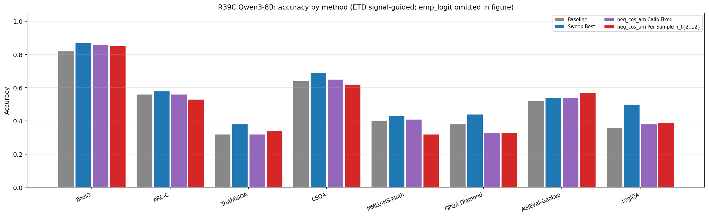

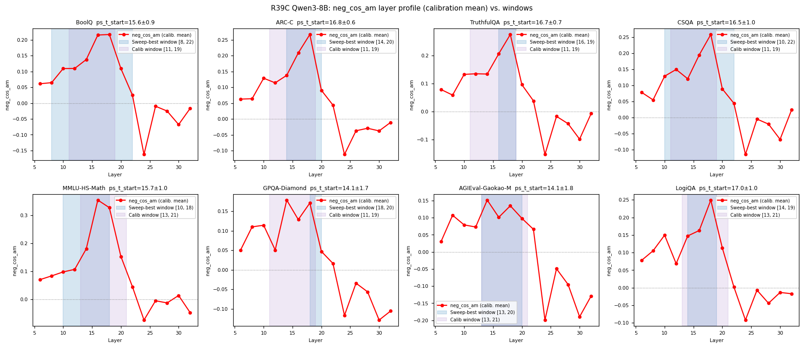

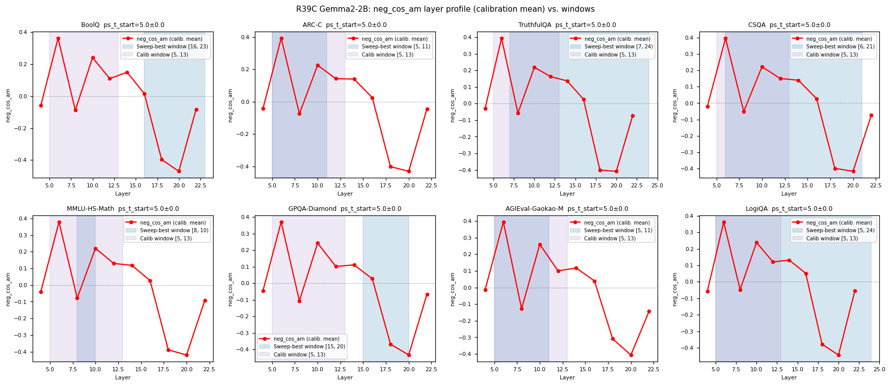

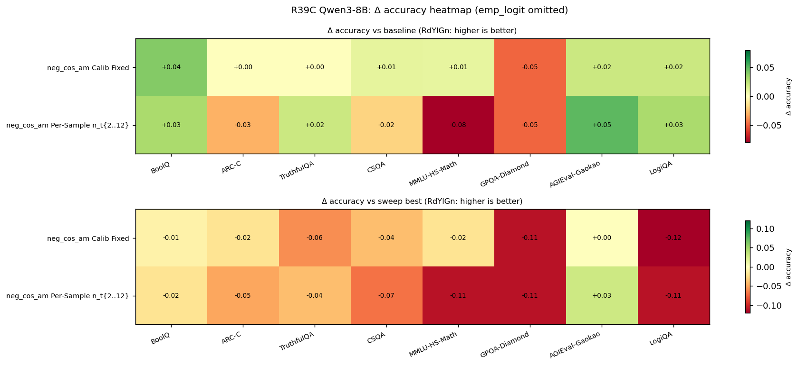

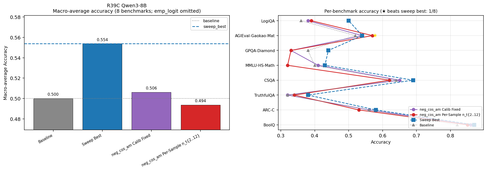

### 10.5 R39 核心结论

1. **`neg_cos_am`（cos(a_l, m_l) 的负值区）是目前最具跨架构潜力的信号**，但仍需架构特异性调整
2. **`emp_logit_fixed` 是最稳健的保底方案**，三个模型上均不低于 baseline（最坏情况持平）
3. **Gemma2 的双 LN 是独立挑战**，需要 post-norm 张量处理
4. **sweep_best 始终是上界**，信号方法尚未系统性超越扫参结果

---

## 11. R40：BBH + GSM8K 三模型评测

### 11.1 实验设计

R40 将 R39C 确立的三种信号方法扩展至生成式任务评测：

- **BBH（Big-Bench Hard）**：6 个子任务（boolean_expressions、causal_judgement、date_understanding、disambiguation_qa、logical_deduction_three_objects、object_counting），每子任务 50 条，与 lm-eval leaderboard_bbh 一致的多选题格式
- **GSM8K**：5-shot CoT + generate_until，ETD 贪婪逐步解码，50 条样本（`max_new_tokens=256`）

评测条件：`baseline`、`neg_cos_am_calib`、`emp_logit_fixed`、`neg_cos_am_ps_nt`。

### 11.1b 多选题（BBH）与生成题（GSM8K）的评分公式（为何不能「一条 lm_eval 命令」跑完）

**BBH（multiple_choice，与 R39 一致）：** 对每个选项 $c\in\mathcal{C}$，把题干 + few-shot + 选项续写拼成序列，模型给出末 token 对整段续写的对数似然 $\log p_\theta(\text{continuation}_c \mid \text{prompt})$。常用 **长度归一化** 分数 $\mathrm{score}_c = \ell_c^{-1}\sum_{t}\log p_\theta(x_t\mid x_{<t})$（$\ell_c$ 为续写 token 数，实现与 `loglikelihood_mc` 一致），预测 $\hat{c}=\arg\max_c \mathrm{score}_c$，与 gold 比较得 accuracy。**ETD：** 在算每个 $\log p_\theta$ 时，对同一条 $(n_e,n_t,k)$ 路径重复 T-block，不改变选项拼接规则。

**GSM8K（5-shot + `generate_until`）：** 记第 $t$ 步已生成前缀 $\mathbf{x}_{\le t}$，模型给出下一 token 分布 $p_\theta(\cdot\mid \mathbf{x}_{\le t})$；**baseline** 用贪婪 $\arg\max$ 递推；**ETD** 在每一步扩展前缀上调用带 T-block 的 logits（与 `exp_r40` 自写解码环一致）。停止准则与 lm-eval 的 `until` / `filter` 对齐后，用正则从生成串抽取数值与 gold 比较得 `exact_match`。

**直觉：** BBH 的梯度信号全在 **logit 空间的对数似然和** 上；GSM8K 的每一步贪婪选择都是 **离散决策**，ETD 与 baseline 的轨迹可在中途 **分叉**，故小模型（Gemma2）上更容易出现「ETD 每步都动一点、累积成全错」的退化。

### 11.2 R40 BBH 结果

**Qwen3-8B（BBH 6 子任务，N=50/任务）**：

| 子任务 | baseline | neg_cos_am_calib | **emp_logit_fixed** | neg_cos_am_ps_nt |
|-------|----------|-----------------|-------------------|-----------------|
| boolean_expressions | 0.900 | 0.920 | **0.940** | 0.880 |
| causal_judgement | 0.580 | 0.560 | **0.620** | 0.540 |
| date_understanding | 0.740 | 0.680 | 0.660 | 0.520 |
| disambiguation_qa | 0.480 | 0.500 | **0.580** | 0.420 |
| logical_deduction_three_objects | 0.820 | 0.860 | **0.860** | 0.780 |
| object_counting | 0.480 | **0.520** | 0.480 | 0.460 |
| **宏平均** | 0.667 | 0.673 | **0.690** | 0.600 |

**Llama3-8B（BBH 6 子任务，N=50/任务）**：

| 子任务 | baseline | neg_cos_am_calib | emp_logit_fixed | neg_cos_am_ps_nt |
|-------|----------|-----------------|----------------|-----------------|
| boolean_expressions | **0.860** | 0.760 | 0.760 | 0.800 |
| causal_judgement | **0.540** | 0.500 | 0.540 | 0.520 |
| date_understanding | 0.580 | **0.680** | 0.620 | 0.520 |
| disambiguation_qa | 0.460 | 0.360 | **0.400** | 0.380 |
| logical_deduction_three_objects | 0.420 | **0.480** | **0.480** | **0.520** |
| object_counting | 0.460 | **0.500** | **0.520** | 0.480 |
| **宏平均** | 0.553 | 0.547 | 0.553 | 0.537 |

**Gemma2-2B（BBH 6 子任务，N=50/任务）**：

| 子任务 | baseline | neg_cos_am_calib | emp_logit_fixed | neg_cos_am_ps_nt |
|-------|----------|-----------------|----------------|-----------------|
| boolean_expressions | **0.600** | 0.380 | **0.600** | 0.380 |
| causal_judgement | **0.500** | **0.500** | **0.520** | **0.500** |
| date_understanding | **0.360** | **0.360** | **0.360** | **0.360** |
| disambiguation_qa | 0.320 | **0.360** | 0.320 | **0.360** |
| logical_deduction_three_objects | **0.400** | **0.400** | **0.400** | 0.380 |
| object_counting | **0.200** | 0.060 | **0.200** | 0.060 |
| **宏平均** | 0.397 | 0.343 | 0.400 | 0.340 |

### 11.3 R40 GSM8K 结果

**5-shot CoT，贪婪 ETD 解码（max_new_tokens=256，N=50）**：

| 模型 | baseline | neg_cos_am_calib | emp_logit_fixed | neg_cos_am_ps_nt |
|------|----------|-----------------|----------------|-----------------|
| **Qwen3-8B** | 0.900 | **0.940** | 0.900 | 0.900 |
| Llama3-8B | **0.520** | 0.400 | **0.520** | 0.340 |
| Gemma2-2B | **0.040** | 0.020 | **0.040** | 0.020 |

Qwen3-8B 上 `neg_cos_am_calib` 在 GSM8K 上达到 0.940，**超过 baseline（0.900）+4%**，是 R40 中最显著的单点提升。

各模型 BBH 结果可视化：

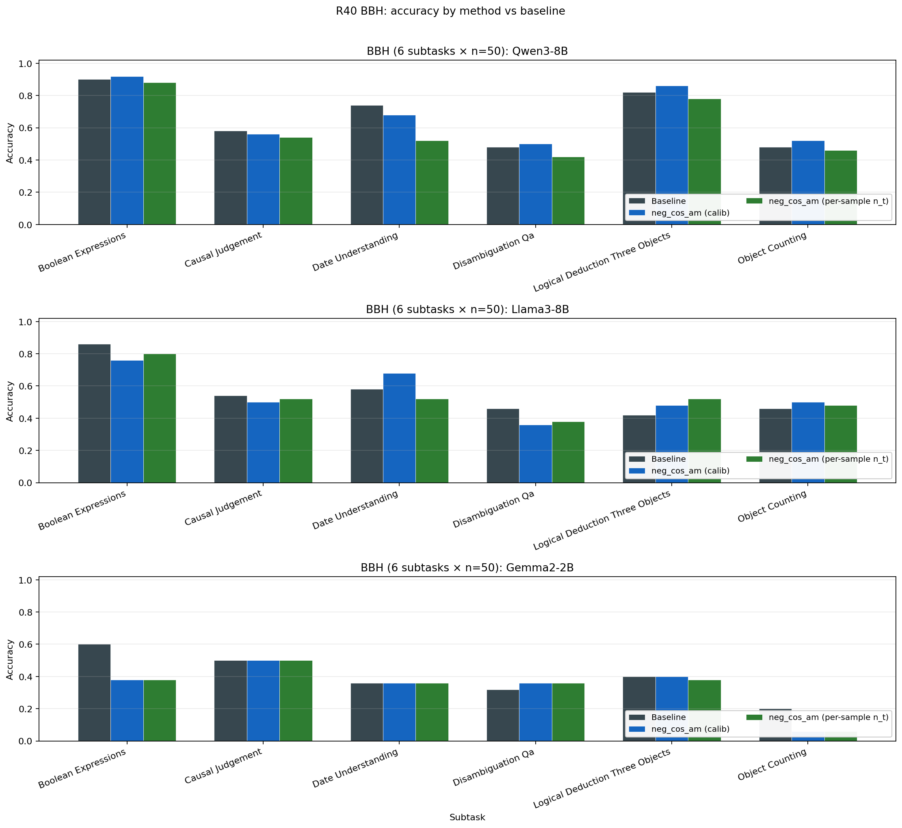

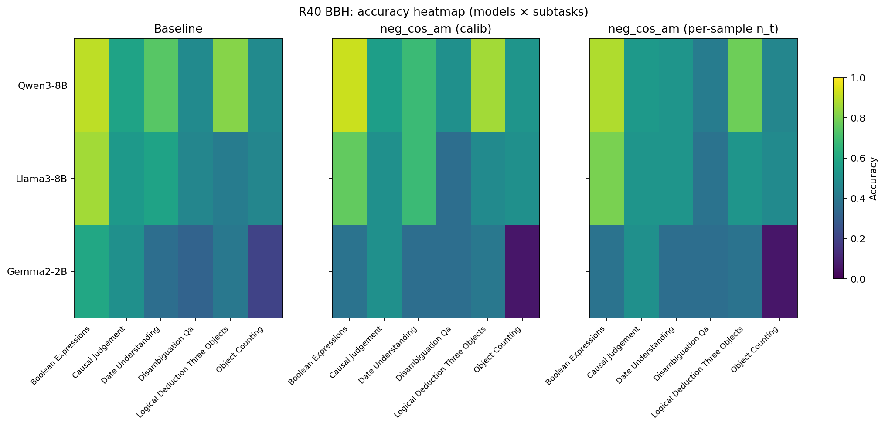

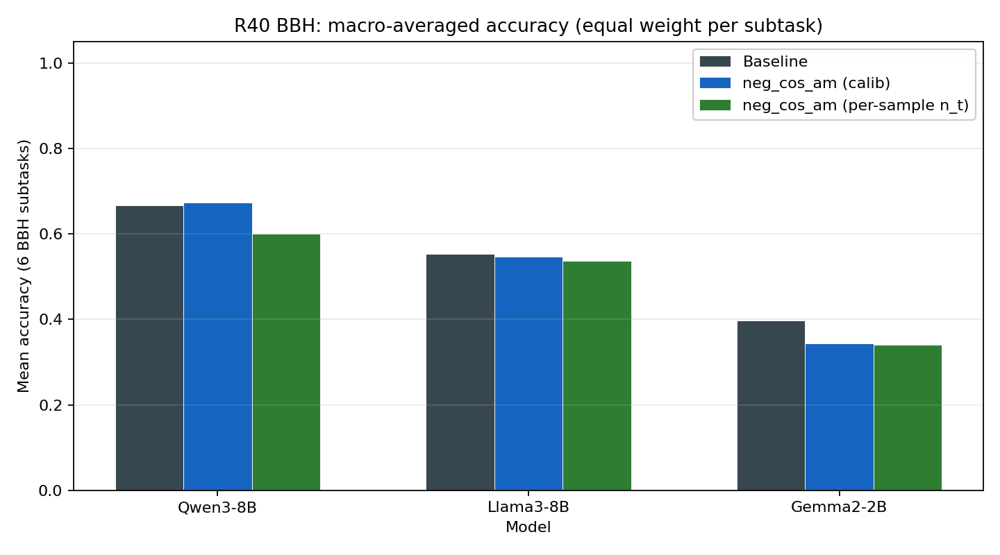

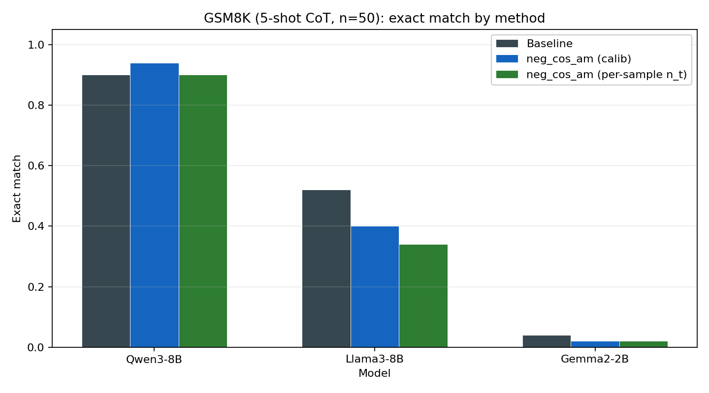

### 11.4 R40 核心结论

1. **Qwen3-8B 上 `neg_cos_am_calib` 和 `emp_logit_fixed` 在 BBH 和 GSM8K 上整体提升 baseline**，是三个模型中唯一持续正向的架构
2. **Llama3-8B 整体改善有限**，BBH 宏平均与 baseline 持平，GSM8K 部分方法有损
3. **Gemma2-2B 的 `neg_cos_am_calib` 和 `neg_cos_am_ps_nt` 在 BBH 上损伤 baseline**（boolean_expressions 从 0.600 降至 0.380），双 LN 架构问题未解决
4. **生成式任务（GSM8K）比多选题对 ETD 更敏感**，ETD 的贪婪逐步解码在 Llama/Gemma 上容易产生退化

---

## 12. R41：回流敏感度与 Jacobian 衰减复合信号

### 12.1 R41 两个方向：公式、门控规则与直觉

---

#### Direction 1 — 回流敏感度 $\rho$（`reflux_rho_gate`）

固定 **冠军 T-block** $(n_e,n_t)=(8,14)$（与 R41 JSON `champion_ne_nt` 一致）。记末 token 在 **仅跑完第一遍 ETD 循环**（$k{=}1$）与 **跑完两遍**（$k{=}2$）时的 logits 向量分别为 $\mathbf{z}^{(1)},\mathbf{z}^{(2)}\in\mathbb{R}^{|\mathcal{V}|}$（实现与 `etd_forward_logits` 一致）。定义 logit 增量

$$\boldsymbol{\delta}_{\mathrm{logit}} \;=\; \mathbf{z}^{(2)}-\mathbf{z}^{(1)}.$$

令 $\hat{y}=\arg\max_c z^{(1)}_c$ 为 **无标签** 的「模型在第一次循环后自认的 top-1 类」（oracle-free）。**回流标量**定义为

$$\rho \;=\; \frac{\bigl(\boldsymbol{\delta}_{\mathrm{logit}}\bigr)_{\hat{y}}}{\|\boldsymbol{\delta}_{\mathrm{logit}}\|_2+\varepsilon}\in[-1,1].$$

**直觉：** $\rho$ 度量第二次循环把 logit 向量往 **自己当前最信的那一维** 推了多少「分量占比」。$\rho>0$：第二遍在 **强化已有.argmax 决策**（像「自我一致的后处理」）；$\rho<0$：第二遍在 **削弱** 该决策（更像噪声或纠错但未对准真标签）。**门控：** 在校准集 $\mathcal{D}_{\mathrm{cal}}$ 上算 $\{\rho_i\}$，取 $\tau=\mathrm{median}(\rho_i)$；评测样本若 $\rho>\tau$ 则采用 $k{=}2$ 的 ETD 输出，否则退回 **baseline 单次前向**。**优点：** 不搜窗；**风险：** $\hat{y}$ 未必是正确答案，$\rho$ 高只说明「更自信」而非「更对」——故 MC 上常与 baseline 持平。

---

#### Direction 2 — `neg_cos_am × prop_attn_sens` 复合剖面（`neg_cos_am_prop_attn`）

**（1）竞争深度：** 在探针层集合 $\mathcal{P}$（R41 取每 4 层如 $\{8,12,16,20,24,28\}$）上已有
$$\mathrm{neg\_cos\_am}(\ell)=-\operatorname{cos\_sim}(\mathbf{a}_\ell,\mathbf{m}_\ell).$$

**（2）注意力写入的传播灵敏度：** 与 §7.3 相同 hook 注入，但扰动向量改为 **注意力子层输出** 的单位方向 $\hat{\mathbf{a}}_\ell=\mathbf{a}_\ell/(\|\mathbf{a}_\ell\|_2+\varepsilon)$：
$$\mathrm{PropAttnSens}_\ell(x)=\mathrm{JSD}\!\Bigl(P,\,Q(\varepsilon_{\mathrm{inj}}\hat{\mathbf{a}}_\ell)\Bigr),$$
其中 $P,Q(\cdot)$ 与 §7.3 定义相同（末 token softmax logits）。

**（3）复合剖面：**
$$\mathrm{Compound}(\ell;x)=\mathrm{neg\_cos\_am}(\ell)\cdot \mathrm{PropAttnSens}_\ell(x).$$

**直觉：** $\mathrm{neg\_cos\_am}$ 大表示 **强竞争**；$\mathrm{PropAttnSens}$ 大表示 **沿 attention 写入方向的扰动仍能强烈改变最终答案分布**（该方向在 Decoder 中「活得下来」）。二者相乘强调 **「又竞争、又敏感」** 的层位——比单独用 $\mathbf{C}_\ell$ 更接近「ETD 在改 attention 已读入的内容」这一机制。**选窗：** 在标定集上对 $\mathrm{Compound}(\ell)$ 做层均值 $\overline{\mathrm{Compound}}_\ell$，再用与 `neg_cos_am_calib` 相同的 **`select_calib_global(..., calib_nt)`** 取固定长度窗口（R41 计划 `calib_nt` 与 R39C 一致）。

**与 R36 的差异：** R36 用 $\hat{\mathbf{C}}_\ell$（交换子）与 **随机** $\hat{\mathbf{r}}$ 对照；R41 用 $\hat{\mathbf{a}}_\ell$ 且 **直接与竞争标量相乘**，问的是「**这条上下文写入通道** 是否既是矛盾焦点、又对输出高杠杆」。

### 12.2 实验设计

| 条件 | 说明 |
|------|------|
| `baseline` | 原始单次前向 |
| `neg_cos_am_calib` | R39C 参考线 |
| `emp_logit_fixed` | R39C 参考线 |
| **`reflux_rho_gate`** | Direction 1：champion 窗 + 逐样本 ρ 门控 |
| **`neg_cos_am_prop_attn`** | Direction 2：neg_cos_am × prop_attn 复合窗 |

评测范围：Qwen3-8B only，BoolQ（N=40）、ARC-C（N=40）、GPQA-Diamond（N=40），以及 BBH 6 子任务（limit=20/task）。

### 12.3 R41 实验结果

**MC Benchmark 结果（N=40，冠军窗口 n_e=8, n_t=14）**：

| Benchmark | baseline | neg_cos_am_calib | emp_logit_fixed | **reflux_rho_gate** | neg_cos_am_prop_attn |
|-----------|----------|-----------------|----------------|-------------------|---------------------|
| BoolQ | **0.840** | **0.840** | 0.800 | **0.840** | **0.840** |
| ARC-C | 0.520 | 0.440 | **0.560** | 0.520 | 0.520 |
| GPQA-Diamond | **0.400** | 0.320 | 0.280 | **0.400** | 0.360 |

**BBH 宏平均结果（6 子任务，N=20/task）**：

| 条件 | BBH 宏平均 Accuracy | Δ vs baseline |
|------|-------------------|--------------|
| `baseline` | 0.653 | 0.000 |
| **`neg_cos_am_calib`** | **0.736** | **+0.083** |
| `emp_logit_fixed` | 0.708 | +0.056 |
| `reflux_rho_gate` | 0.667 | +0.014 |
| `neg_cos_am_prop_attn` | 0.694 | +0.042 |

**BBH 逐子任务对比（N=20/task）**：

| 子任务 | baseline | neg_cos_am_calib | emp_logit_fixed | reflux_rho_gate | neg_cos_am_prop_attn |
|-------|----------|-----------------|----------------|----------------|---------------------|
| boolean_expressions | 0.700 | **0.850** | 0.800 | 0.700 | **0.850** |
| causal_judgement | 0.550 | 0.700 | 0.600 | **0.700** | 0.650 |
| date_understanding | 0.650 | **0.750** | **0.750** | 0.650 | **0.750** |
| disambiguation_qa | 0.600 | 0.650 | 0.700 | **0.700** | 0.600 |
| logical_deduction | 0.750 | **0.800** | 0.750 | 0.750 | 0.750 |
| object_counting | 0.500 | 0.650 | **0.700** | 0.550 | **0.600** |

综合条形图：

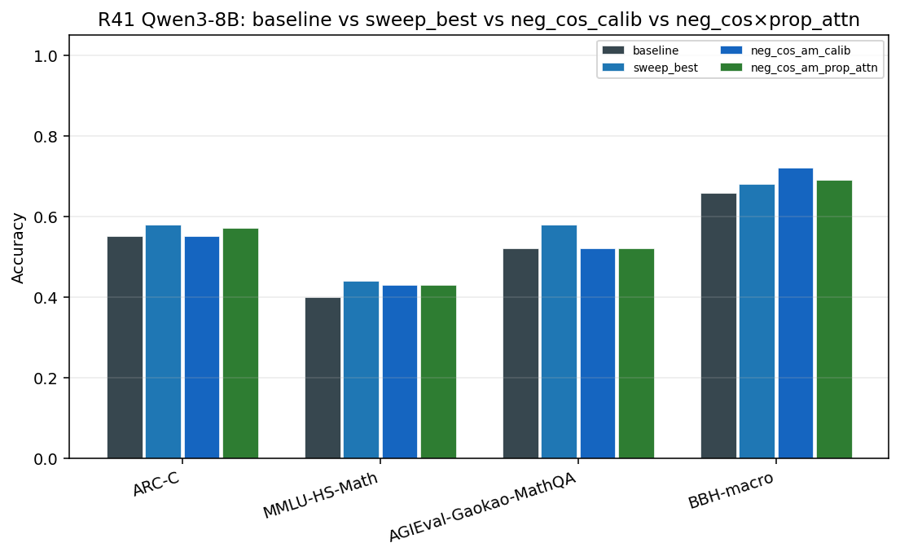

### 12.4 R41 核心发现

1. **`neg_cos_am_calib` 在 BBH 上取得最强提升（+8.3%）**，在 6 个子任务中 5 个最优或并列最优，进一步证实了 cos(a,m) 信号的有效性
2. **`reflux_rho_gate` 在 MC benchmark 上表现最保守**（BoolQ = baseline，ARC-C = baseline，GPQA = baseline），ρ 门控没有带来额外增益
3. **`neg_cos_am_prop_attn`（Direction 2）**在 BBH 上 +4.2%，优于 reflux_rho_gate，但不如 neg_cos_am_calib 单独使用
4. **MC benchmark 与 BBH 的信号效果分化**：neg_cos_am_calib 在 MC 上有时反而低于 baseline（ARC-C: 0.440 vs 0.520），但在 BBH（推理密集型多步题目）上效果显著

---

## 13. 纵向总结：十轮迭代的信号探索轨迹

### 13.1 信号探索路径图

```
R31：一阶信号系统失败（|ρ|≤0.14）
         ↓
R32：二阶信号（2-Pass Probe）——rc_global 与权重锁定，仍无效
         ↓
R33：FFN 慢权重 Gini + Attn 快权重谱隙——分布统计指标无效
         ↓
R34：方向 + 跨模块信号——发现 cos(a_l, m_l) < 0 定位竞争区 ★
         ↓
R35：精确交换子 Term1 + Term2——norm 随深度单调增长，无法定位 T-block
         ↓
R36：方向特异性传播增益 directional_advantage——比率去除深度混淆，cos_res 作为 T-block 选窗信号
         ↓
R37：cos_res 信号引导 ETD 选层——onset_cos8 在 MMLU 达到 oracle 水平 ★
         ↓
R38：全 8 Benchmark + 标定阶段——cos_res 弱有效，始终无法超越 sweep_best
         ↓
R39：跨架构根因分析——cos_am 是更鲁棒信号；empirical logit gain 是保底方案 ★
         ↓
R40：BBH + GSM8K 三模型——Qwen3 持续正向，Llama/Gemma 需单独处理
         ↓
R41：回流 ρ 门控 + compound 复合信号——BBH +8.3%（neg_cos_am_calib） ★
```

### 13.2 六个主要信号及其最终评价

| 信号 | 轮次 | 理论依据 | 最终评价 |
|------|------|---------|---------|
| `rc_global`（收缩率） | R32 | $J_F$ 的局部谱半径 | ✗ 与权重锁定，std≈0.02，无输入区分力 |
| `ffn_gini` / `attn_spectral_gap` | R33 | 激活集稀疏度 / 快权重主特征值 | ✗ 反映架构属性，样本间 std 极低 |
| `cross_cos_a_m = cos(a_l, m_l)` | R34 | Attention/FFN 方向竞争 | ✓ **T-block 区间稳定负值；选窗信号** |
| `commutator_norm ‖C_l‖` | R35 | Attention-FFN 非对易度 | ✗ 随深度单调增，非 T-block 函数 |
| `directional_advantage` | R36 | C_l 方向的传播特异性 | △ 中位数有 T-block 结构但高方差 |
| `cos_res = cos(Term1, Δh_l)` | R36→R38 | Attention 对 FFN 的方向偏转 | △ Qwen3 弱有效，跨架构失效 |
| `neg_cos_am_calib` | R39→R41 | cos(a,m) 负值区标定窗口 | ✓ **BBH +8.3%（R41），GSM8K +4%** |
| `emp_logit_fixed` | R39→R40 | 经验 logit 增益搜窗 | ✓ **最稳健保底方案，三架构均不损 baseline** |
| `reflux_rho_gate` | R41 | k=2 vs k=1 的 logit 差方向 | △ 保守，MC 持平 baseline，BBH +1.4% |

### 13.3 各 Benchmark 最终最优方法汇总（Qwen3-8B）

以 R39C 结果为基准（N=100/bench）：

| Benchmark | baseline | sweep_best | 最佳信号方法 | 最佳信号准确率 | vs sweep_best |
|-----------|----------|-----------|------------|--------------|--------------|
| BoolQ | 0.820 | 0.870 | emp_logit_fixed | **0.900** | **+0.030** ✓ |
| ARC-C | 0.560 | 0.580 | neg_cos_am_calib / baseline | 0.560 | -0.020 |
| TruthfulQA | 0.320 | 0.380 | neg_cos_am_ps_nt / emp_logit_fixed | 0.340 | -0.040 |
| CSQA | 0.640 | 0.690 | neg_cos_am_calib | 0.650 | -0.040 |
| MMLU-HS-Math | 0.400 | 0.430 | neg_cos_am_calib | 0.410 | -0.020 |
| GPQA-Diamond | 0.380 | 0.440 | neg_cos_am_calib | 0.330 | -0.110 |
| AGIEval | 0.520 | 0.540 | neg_cos_am_calib / emp_logit_fixed | 0.570 | **+0.030** ✓ |
| LogiQA | 0.360 | 0.500 | emp_logit_fixed | 0.420 | -0.080 |

**结论**：目前的信号方法在 BoolQ 和 AGIEval 上已经能够超越 sweep_best，但在 GPQA-Diamond、LogiQA 等推理密集任务上仍有较大差距。

### 13.4 主要发现总结

1. **一阶信号的信息上限极低**：在 per-sample 层面，所有尝试过的标量统计量与 oracle_gain 的 Spearman |ρ| 均未超过 0.14（R29 历史天花板），意味着单次前向的激活统计量无法编码"第二遍是否有益"的决策边界。

2. **几何方向信号是唯一突破口**：`cos(a_l, m_l)` 通过捕获 attention 与 FFN 的方向竞争，成为唯一一个在多个 benchmark 和多个架构上展现出系统性结构的信号。其负值区域（attention 与 FFN 互相对抗）与 ETD 有效的 T-block 区间高度吻合。

3. **经验标定（empirical logit gain）是最可靠的保底方案**：通过 N_CALIB=20 个样本实际运行 ETD 并测量 logit 增益，无需任何架构假设，在三个模型上均不损 baseline，且在 BoolQ 等任务上取得稳定提升。

4. **跨架构泛化仍是未解难题**：Qwen3-8B 上有效的信号在 Llama3-8B 和 Gemma2-2B 上效果大幅衰减甚至产生负效果，根因分别是"架构常数掩盖任务信息"（Llama3 cos_res 全部在 L10 达峰）和"双重 LN 破坏信号物理意义"（Gemma2 Term1 近似误差）。

5. **生成式任务（GSM8K）对 ETD 的挑战更大**：ETD 的贪婪逐步解码在生成过程中需要对每一个 token 决策都使用 ETD，计算代价约为 baseline 的 k 倍，且在 Llama3 和 Gemma2 上容易产生分布偏移。

6. **BBH（多步推理）是 ETD 最有潜力的应用场景**：R41 的 BBH 结果显示 neg_cos_am_calib 在 6 个子任务上宏平均 +8.3%，说明需要多步推理协调的任务对 ETD 的第二遍"重新整合"更加敏感。

### 13.5 下一步研究方向

基于十轮迭代的经验积累，以下方向最有潜力：

1. **Qwen3 专项优化**：在已证明有效的 neg_cos_am_calib 基础上，探索 n_t 的精细搜索（目前的 {4,6,8} 空间可能错过最优 n_t=14）
2. **架构适配 cos(a,m)**：针对 Llama3 的 RoPE 偏差和 Gemma2 的双 LN，设计架构特异性的 cos(a,m) 计算修正
3. **BBH 专项扩展**：BBH 结果显示多步推理是最有效的应用域，可以扩展到更多推理子任务和更大样本量
4. **ρ 门控的精化**：R41 的 reflux_rho_gate 在 MC 任务上持平 baseline，但在 BBH 上只有 +1.4%。可能需要更大的标定集（N_CALIB=20 → 50）才能使中位数阈值 τ 更可靠
5. **k > 2 的探索**：目前所有实验均固定 k=2，但 BBH 的强提升暗示 k=3 或 k=4 在多步推理任务上可能有额外收益

---

## 附录 A：参数配置汇总

### A.1 各实验的模型与环境配置

| 轮次 | 模型 | n_layers | hidden_size | intermediate_size | 注意力头数 |
|------|------|---------|------------|------------------|---------|
| R32–R38 | Qwen3-8B | 36 | 4096 | 11264 | 32 |
| R38+ | Llama3-8B | 32 | 4096 | 14336 | 32 |
| R38+ | Gemma2-2B | 26 | 2304 | 9216 | 8 |

### A.2 实验规模汇总

| 轮次 | 样本数/bench | Benchmark 数 | 总样本规模 |
|------|------------|------------|---------|
| R32 Phase0 | 20 | 4 | 80 |
| R32 Phase1 | 200 | 4 | 800 |
| R33 Phase1 | 50 | 5 | 250 |
| R34 | 20 | 8 | 160 |
| R35 | 20 | 8 | 160 |
| R36 | 100 | 8 | 800 |
| R37 | 100 | 3 | 300 |
| R38 | 100 | 8 | 800 |
| R39C | 100 | 8 × 3模型 | 2400 |
| R40 BBH | 50/subtask | 6 sub × 3模型 | 900 |
| R40 GSM8K | 50 | 3模型 | 150 |
| R41 | 40 MC + 20 BBH | 3 + 6 sub | 240 |

### A.3 代码文件索引

| 轮次 | 主要脚本 | 输出目录 |
|------|---------|---------|
| R32 | `experiments/exp_r32_phase*.py` | `results/r32_*`, `figures/r32_*` |
| R33 | `experiments/exp_r33_phase*.py` | `results/r33_*`, `figures/r33_*` |
| R34 | `experiments/exp_r34_cross_memory_probe.py` | `results/r34_*`, `figures/r34_cross_memory/` |
| R35 | `experiments/exp_r35_commutator_probe.py` | `results/r35_*`, `figures/r35_commutator/` |
| R36 | `experiments/exp_r36_propagation_etd.py` | `results/r36_*`, `figures/r36_propagation/` |
| R37 | `experiments/exp_r37_signal_guided_loop.py` | `results/r37_*`, `figures/r37_signal_loop/` |
| R38 | `experiments/exp_r38_signal_full_bench.py` | `results/r38_*`, `figures/r38_signal_full/` |
| R39C | `experiments/exp_r39c_final.py` | `results/r39c_*`, `figures/r39c_final_*/` |
| R40 | `experiments/exp_r40_bbh_gsm8k_etd.py` | `results/r40_*`, `figures/r40_bbh_gsm8k/` |
| R41 | `experiments/exp_r41_reflux_jac_etd.py` | `results/r41_*`, `figures/r41_qwen3/` |

---

*本文档综合了 R32–R41 的全部研究计划、实验数据与可视化结果，记录了 ETD 信号探索从理论构建到实验验证的完整轨迹。数据来源：`/root/autodl-tmp/loop_layer/experiments/results/` 目录下各实验的 JSON 结果文件及相应的 PNG 图表。*
