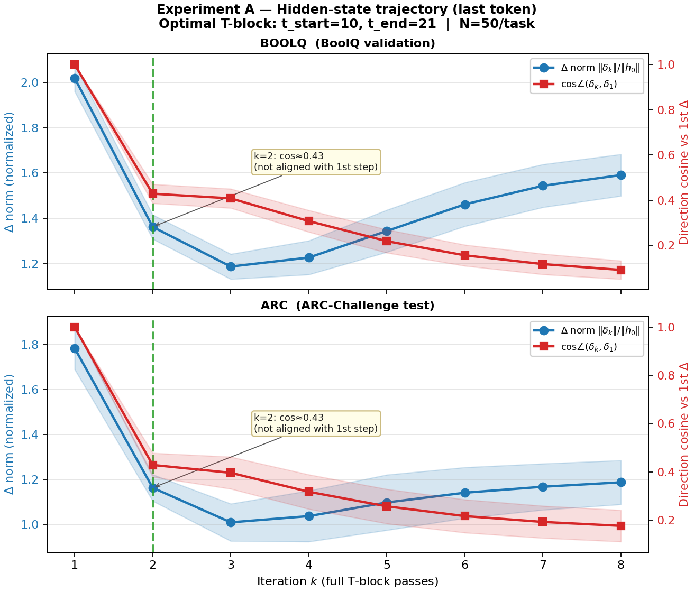
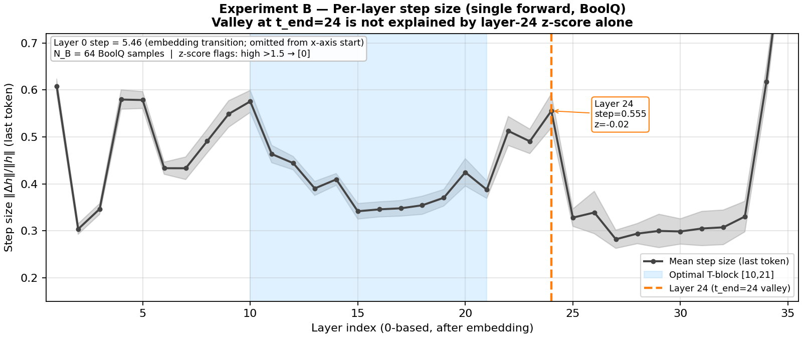
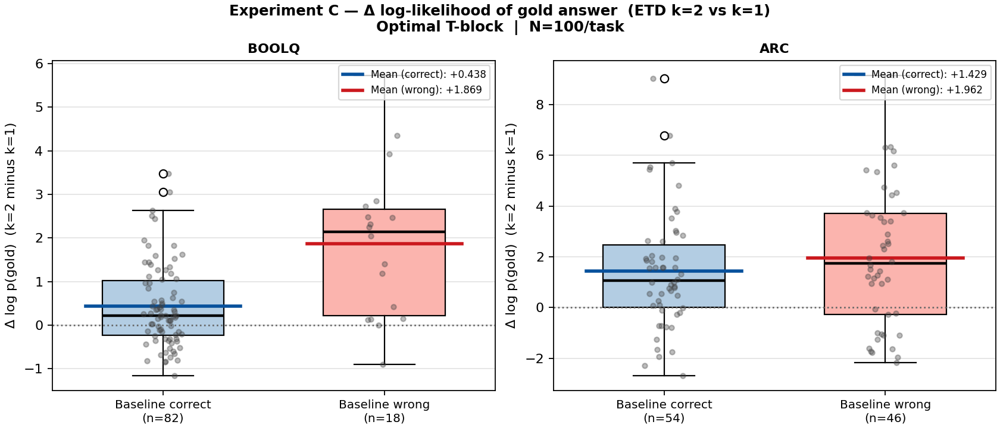
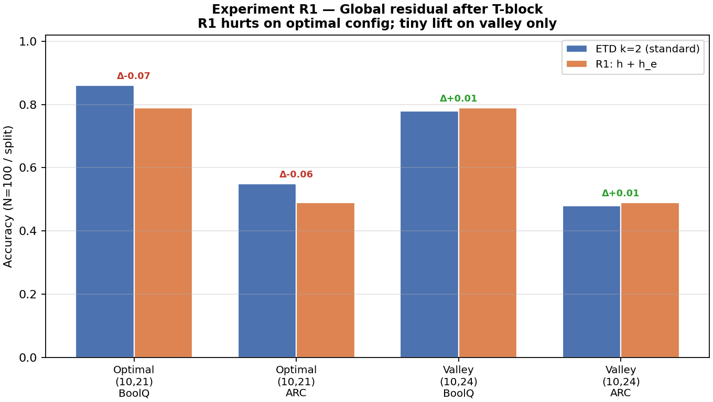

# 综合实验 A+B+C+R1 分析报告

本文档对应 **ETD 机制前置实验**：在固定最优 T 块配置下，测量隐层轨迹（A）、逐层步长（B）、正确答案对数似然变化（C），以及全局残差方案 R1 的准确率对比。  
**原始数据**：`experiments/results/abc_r1_results.json`  
**配图脚本**：`experiments/plot_abc_r1_figures.py`（从 JSON 重绘，无需重新跑 GPU）

---

## 总览：实验目的与顺序

| 实验 | 核心问题 | 主要结论（一句话） |
|------|----------|-------------------|
| **A** | T 块重复时，隐状态是否沿稳定方向收敛？ | **否**：k=2 起与第一步方向夹角大（cos≈0.43），更像探索而非收敛精炼。 |
| **B** | t_end=24 的「谷」是否由某一层的异常大步长引起？ | **单层 24 的 z-score 正常**；高步长区更像 20–24 集体行为，非单点异常。 |
| **C** | ETD 是在「抬高 gold 的 log p」吗？对做对/做错样本是否不同？ | **两组 gold log p 平均都上升**；解释需结合校准与 margin，而非简单「只强化正确」。 |
| **R1** | 末尾加回 `h_e` 能否稳定输出？ | **最优配置显著变差**；谷底配置仅有 **+0.01** 量级微小回升，不足以作为主力方案。 |

全局配置常量（与 `exp_abc_r1.py` 一致）：

- **最优 T 块**（BoolQ sweep 最优）：`t_start=10`, `t_end=21` → `n_e=10`, `n_t=12`
- **谷底 T 块**（用于对照）：`t_start=10`, `t_end=24` → `n_t=15`
- 模型：**Qwen3-8B**，本地权重路径见脚本中 `MODEL_PATH`

---

## 实验 A：隐层轨迹（Hidden-state trajectory）

### 设置与符号

- **样本**：BoolQ validation 与 ARC-Challenge test 各 **N_A=50** 条（与脚本一致）。
- **配置**：仅使用**最优** `(t_start,t_end)=(10,21)`，对每条样本跑 E→T 重复至多 **K_MAX=8** 次。
- **测量（last token）**：
  - **h₀**：E 段结束后最后一 token 的隐向量。
  - **第 k 步**：再完整跑一遍 T 块后最后一 token 隐向量 **h_k**。
  - **Δ norm（图中 delta_norm）**：\(\|\mathbf{h}_k-\mathbf{h}_{k-1}\| / \|\mathbf{h}_0\|\)（相对第一步尺度的步长）。
  - **cos_sim**：\(\cos\angle(\mathbf{h}_k-\mathbf{h}_{k-1},\, \mathbf{h}_1-\mathbf{h}_0)\)。k=1 时无「前一步 T 内增量」，脚本将 cos 置为 **1.0**；**k≥2** 表示「当前这一步相对第一步方向是否一致」。

### 意义

若 T 块迭代是「在同一推理方向上微调」，应看到 **cos_sim 长期接近 1** 且 **Δ norm 单调下降至很小**。若出现 **cos 明显低于 1**（尤其 k=2），说明第二步与第一步**不在同一几何方向**，与「收敛式精炼」直觉不符，更接近在固定注意力结构下的**再映射 / 探索**。

### 结果要点

- **Δ norm**：从 k=1→2 大幅下降后，在 k=3–8 有波动，**并非单调逼近 0**。
- **cos_sim**：k=2 时均值约 **0.43**（BoolQ/ARC 接近），之后继续下降，平均 cos（k=2…8）落在 **0.2–0.3** 量级，属**方向振荡**而非「沿同一梯度方向前进」。
- **解读**：与后续「阻尼 R2」「有效步长」叙事一致——无阻尼的重复 T 块会改变隐状态方向；**不能**把多次 T 简单类比为「同一思考链的加深」。

### 配图

**读图**：蓝线：相对步长；红线：方向余弦（k≥2 相对第一步位移）。绿色虚线标出 **k=2**，图中文字强调 **cos≈0.43**。

---

## 实验 B：逐层步长（Per-layer step size）

### 设置

- **样本**：BoolQ **N_B=64** 条；单次标准前向，`output_hidden_states=True`。
- **定义**：对每层 \(l=0..35\)，取 **last token**，  
  \(\text{step}_l = \|\mathbf{h}_{l+1}-\mathbf{h}_l\| / \|\mathbf{h}_l\|\)（与 LP 实验中 step_size 同型）。
- **统计**：对 64 条样本在层维上取 **均值与标准差**；并对 36 层均值做 **z-score**（相对 36 层自身的均值/方差），用于标记「相对全体层偏高/偏低」的层。

### 意义

若 **t_end=24** 的准确率谷来自「第 24 层本身异常」，则该层 **z-score 应极端** 或 step 显著离群。若否，则 valley 更可能来自 **T 块长度、多轮重复与 D 段衔接** 等**组合效应**。

### 结果要点

- **高 z 层（|z|>1.5 脚本阈值）**：数据中标记为 **layer 0**（嵌入后第一层，步长尺度与后续层不可比，需在图中单独说明）。
- **Layer 24**：步长约 **0.555**，**z≈−0.02**，**不属于**「单层高步长异常」。
- **区间**：最优配置 T 块 **10–21** 在图中以**浅蓝带**标出；**Layer 24** 以**橙色竖线**标出，并附局部注释。
- **解读**：与报告早期结论一致——**valley 不宜归结为第 24 层单独坏层**；更宜与 **20–24 一带集体高步长**、以及 **ETD 重复带来的过冲** 一起理解（后续 R2 阻尼针对的是「迭代步长」而非「单层改名」）。

### 配图

**读图**：横轴为 **layer 索引**（图中从 1 起绘制，避免嵌入跃迁压扁纵轴）；浅蓝带为最优 **T-block [10,21]**；橙线标注 **layer 24**。左上角文字说明 **layer 0** 的数值与剔除原因。

---

## 实验 C：答案概率变化（Gold log-likelihood benefit）

### 设置

- **样本**：BoolQ / ARC 各 **N_C=100**。
- **配置**：最优 `(10,21)`，对比 **k=1** 与 **k=2** 的 ETD 前向（k=1 即单次通过 T，不重复）。
- **分组**：用 **k=1 的预测** 是否等于 gold 将样本分为 **Baseline correct** / **Baseline wrong**。
- **指标**：对每条样本计算  
  **benefit** = log p_k=2(gold) − log p_k=1(gold)（continuation 上 gold 选项的对数似然差）。

### 意义

若 ETD **只强化已正确样本**，可能看到 **correct 组 benefit≫0** 且 **wrong 组≤0**（「固化错误」）。若两组 benefit 均为正，说明 **两次通过 T 块普遍抬高 gold 的 log p**，但**不保证** argmax 标签改变——需与 **margin、校准** 联合解读。

### 结果要点（见 JSON 与箱线图）

| 任务 | Baseline 对（n） | 错（n） | mean benefit（对） | mean benefit（错） |
|------|------------------|--------|---------------------|---------------------|
| BoolQ | 82 | 18 | +0.438 | +1.869 |
| ARC   | 54 | 46 | +1.429 | +1.962 |

- 两组 **平均 benefit 均为正**：表明在该度量下，**第二次 T 遍往往增加 gold 的 log 似然**；错题组均值更高并不等价于「更容易答对」，可能与 **错例上初始 log p 更低、抬升空间更大** 有关。
- **解读**：与后文 **C2 / margin** 及 **Selective ETD** 叙事衔接——机制上更贴近 **「重分配概率质量」** 而非单一「强化正确标签」。

### 配图

**读图**：两组箱线 + 散点；蓝/红水平线为组均值；纵轴为 **Δ log p(gold)**。

---

## 实验 R1：全局残差（h ← h + h_e after T）

### 设置

- **样本**：各任务 **N_R1=100**。
- **对比模型**：
  - **ETD k=2（标准）**：与主实验相同的 `etd_forward_logits` 路径。
  - **R1**：T 块重复 k=2 次后，**在进入 D 段之前** 执行 **h ← h + h_e**（**h_e** 为 E 段末隐状态；实现见 `etd_forward_r1`）。
- **配置**：
  - **optimal**：(10, 21)
  - **valley**：(10, 24)

### 意义

若漂移/过冲是主要矛盾，**加回 h_e** 可能把表示拉回「编码器邻域」。但若 **D 段已适配无残差的流形**，强行相加可能导致 **分布偏移**，从而在**最优配置**上伤精度。

### 结果要点

| 配置 | 任务 | ETD k=2 | R1 | Δ |
|------|------|---------|-----|-----|
| optimal | BoolQ | 0.86 | 0.79 | **−0.07** |
| optimal | ARC   | 0.55 | 0.49 | **−0.06** |
| valley  | BoolQ | 0.78 | 0.79 | +0.01 |
| valley  | ARC   | 0.48 | 0.49 | +0.01 |

- **最优配置**：R1 **明确有害**，支持「**非简单加性残差**」的结论，并推动 **R2 阻尼**（α∈(0,1)）而非裸加法。
- **谷底配置**：仅有 **微小** 正向 Δ（0.01），统计上需谨慎，但可作为「过冲缓解方向」的弱证据。

### 配图

**读图**：四组柱：最优/谷底 × BoolQ/ARC；蓝=标准 ETD k=2，橙=R1；柱上为 **Δ**。

---

## 综合结论与后续路线（与主项目一致）

1. **机制**：A 表明重复 T 块**非**「同一方向上的收敛」；C 表明 gold log p 变化需**分组与 margin** 解读；B 将 valley **从单层异常中部分排除**。
2. **改进路径**：R1 在最优区**失败** → 优先 **R2 阻尼** 与 **有效步长 / 总能量** 公式，而非全局残差相加。
3. **复现**：完整重跑 `python experiments/exp_abc_r1.py` 会刷新 JSON 并尝试调用 `plot_abc_r1_figures.py` 更新图；仅重绘图可单独运行后者。

---

## 自动生成摘要（表格，便于核对）

以下为从最新 `abc_r1_results.json` 抽取的数值摘要（若重跑实验，以 JSON 为准）。

### 实验 A（k=1..8）

详见 JSON `experiment_A` 中 `delta_norm_mean` / `cos_sim_mean`。

### 实验 B

- 高步长层（z>1.5）：见 JSON `high_step_layers`
- Layer 24 step / z：见 JSON `mean_step_size[24]`、`z_scores[24]`

### 实验 C / R1

见 JSON `experiment_C`、`experiment_R1`。

---

*运行 `exp_abc_r1.py` 时，简短机器摘要写入 `abc_r1_report_auto.md`；**本文档**为图文详细版，不会被脚本覆盖。*
