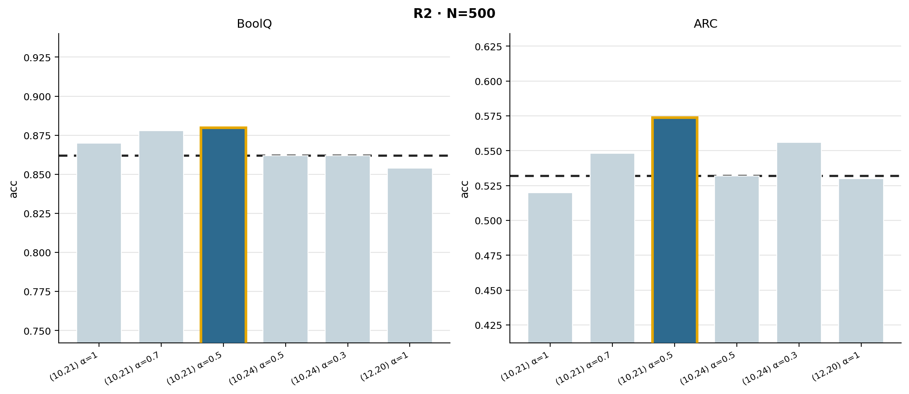
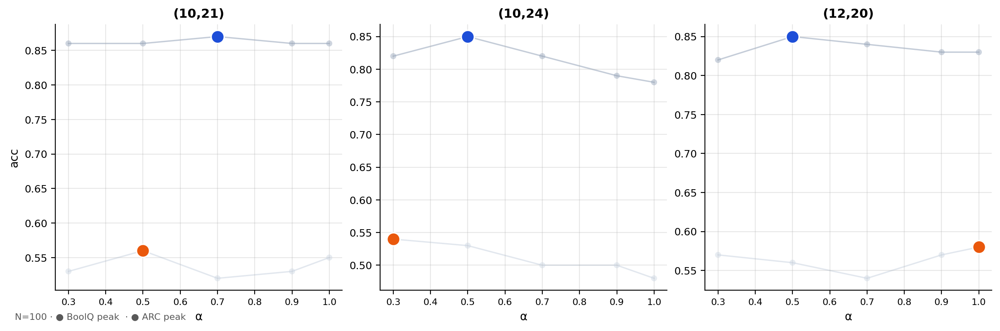
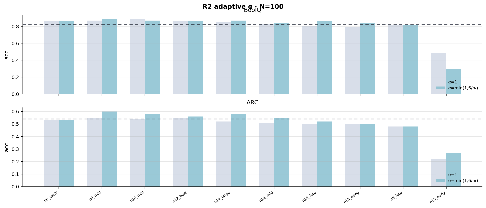
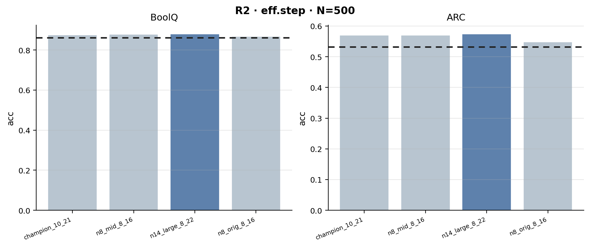
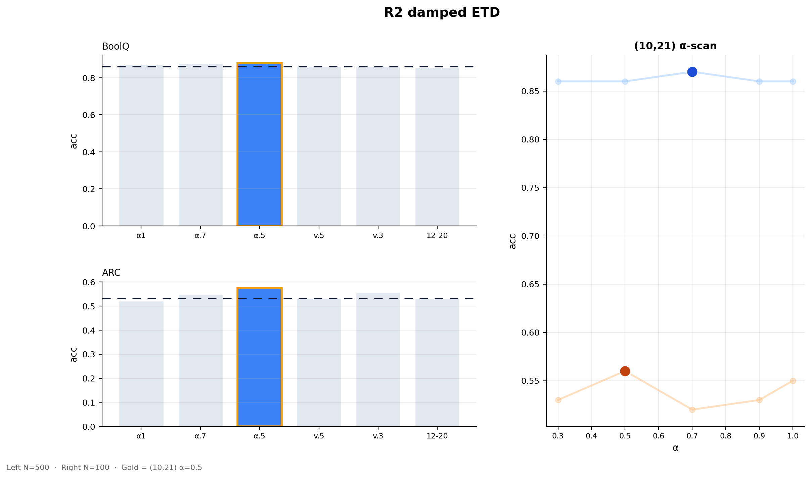

# R2 阻尼 ETD（Damped ETD）实验汇报

本文档汇总 **R2：在 T 块迭代中加入阻尼系数 α** 的系列实验：动机、设置、**定量结果**与**配图解读**。  
模型：**Qwen3-8B**；ETD 实现见 `loop_layer/ETD/etd_forward.py`。

---

## 1. 背景与问题

### 1.1 原版 ETD 的现象

在层扫描与机制分析中，**无阻尼（α=1）** 的 T 块重复会使隐状态步幅过大，尤其在 **ARC** 上常出现 **低于标准前向 baseline** 的情况；在 **t_end≈24** 等配置还会出现准确率「谷」。这说明需要 **约束每次迭代的有效步长**，而不是无限次重复同一子网络。

### 1.2 R2 的数学含义（实现层面）

在每次 T 块完整前向结束后，用当前隐状态与**上一步**隐状态做凸组合（与你们代码一致）：

- **α 较小**：新一步输出占比低，轨迹更「粘」在旧状态附近，**抑制过冲**；
- **α=1**：退化为**无阻尼**，即原版 ETD。

后续在叙事中常把 **α × nₜ** 称为**有效步长**（nₜ 为 T 块层数），并在 **n8 验证**中与 **≈6** 的经验最优点对照（见第 5 节）。

---

## 2. 数据与脚本索引

| 内容 | 文件路径 |
|------|----------|
| 500 样本完整验证 | `experiments/results/r2_full_validate.json` |
| α 扫描（多空间配置，N=100） | `experiments/results/r2_c2_results.json` |
| 自适应 α=min(1,6/nₜ) 泛化（N=100） | `experiments/results/r2_generalize_results.json` |
| 有效步长理论对照（N=500） | `experiments/results/n8_validate_results.json` |
| 汇报配图生成脚本 | `experiments/plot_r2_present.py` |
| 配图输出目录 | `experiments/figures/r2_present_*.png` |

重绘配图：

```bash
cd /root/autodl-tmp/loop_layer/experiments && python3 plot_r2_present.py
```

---

## 3. 核心结论（500 样本主结果）

**基准**：标准单次前向（无 T 块重复），BoolQ validation **0.862**，ARC-Challenge test **0.532**（与 JSON 中 `baseline` 一致）。

**主配置**：**t_start=10, t_end=21**，**k=2**，**α=0.5**（R2 阻尼）。

| 指标 | BoolQ | ARC |
|------|-------|-----|
| Baseline | 0.862 | 0.532 |
| 原版 ETD（同配置 α=1） | 0.870（Δ+0.008） | 0.520（Δ−0.012） |
| **R2（α=0.5）** | **0.880（Δ+0.018）** | **0.574（Δ+0.042）** |

**解读要点**：

- 在同一 **BoolQ 最优格 (10,21)** 上，**α=1 时 ARC 已低于 baseline**；**α=0.5 时 ARC 明显反超**，说明 **阻尼对推理任务尤为关键**。
- BoolQ 在 α=1 时已略高于 baseline，**R2 进一步抬高**，主结论与「有效步长」叙事一致。

---

## 4. 配图一：500 样本柱状对比（主图）

**文件**：`figures/r2_present_fullvalidate.png`



### 4.1 图面元素说明

- **左右两子图**：左 **BoolQ**，右 **ARC**；纵轴为 **准确率 acc**。
- **黑色虚线**：各自 **baseline**（BoolQ 0.862，ARC 0.532）。
- **横轴六组柱**（从左到右）：
  1. **(10,21) α=1**：无阻尼，对应 JSON 键 `orig_opt`。
  2. **(10,21) α=0.7**：`r2_07_opt`。
  3. **(10,21) α=0.5**：`r2_05_opt` —— **深蓝柱 + 金黄色描边**为脚本强调的主结论。
  4. **(10,24) α=0.5**：谷底区间，`r2_05_valley`。
  5. **(10,24) α=0.3**：更强阻尼，`r2_03_valley`。
  6. **(12,20) α=1**：ARC sweep 上的另一优格对照，`arc_opt_orig`。

- **颜色语义**：除主结论柱为 **深蓝** 外，其余为 **浅灰蓝**，表示「同一图中全部展示，但视觉突出 α=0.5 最优格」。

### 4.2 读图要点（结合数值）

- **BoolQ**：从 α=1→0.7→0.5 **单调略升**（0.87→0.878→0.88）；谷底 (10,24) 在 α=0.5 时与 baseline **持平**（0.862），说明该区间对 BoolQ 仍难优于无 ETD。
- **ARC**：**(10,21) α=0.5** 达到 **0.574**，相对 baseline **+0.042**；**(10,24) α=0.3** 时 ARC 为 **0.556**，说明 **强阻尼** 对谷底 ARC 有帮助，但 **主叙事仍放在 (10,21)+α=0.5**。
- **(12,20) α=1**：ARC 仍略低于 baseline（0.53 vs 0.532），提示 **空间配置与阻尼需联合选择**，不能只看 ARC 单任务最优格。

### 4.3 纵轴范围

脚本将 y 轴设为「baseline 附近±一段」，**左右子图刻度范围不同**，便于看清各自差异；**比较请以数值为准**，不要仅凭柱的相对高度跨任务对比。

---

## 5. 配图二：α 扫描（三空间配置，N=100）

**文件**：`figures/r2_present_alpha_sweeps.png`



**数据**：`r2_c2_results.json` → `experiment_R2`，**每任务 N=100**（见 JSON `config.N_EVAL`）。

### 5.1 三个子图列

| 列标题 | 含义 | t_start, t_end |
|--------|------|----------------|
| (10,21) | BoolQ 常用最优格 | 10, 21 |
| (10,24) | 准确率「谷」对照 | 10, 24 |
| (12,20) | ARC sweep 优格之一 | 12, 20 |

### 5.2 曲线与散点

- **淡色折线 + 小点**：在 α∈{0.3,0.5,0.7,0.9,1.0} 上 **BoolQ**（偏灰蓝）与 **ARC**（更浅灰）的完整折线，**全部数据都画出来**，避免「只报最优点」的质疑。
- **大蓝点**：该空间配置下，JSON 中 **BoolQ 的 `best_alpha` 与 `best_acc`**（离散 α 集合上的最优）。
- **大橙点**：同一配置下 **ARC 的 `best_alpha` 与 `best_acc`**。

**注意**：BoolQ 与 ARC 的 **best α 可以不同**（例如 BoolQ 最优在 0.7，ARC 最优在 0.5），因此 **同列两个大点横坐标可能不一致**，这是正常现象。

### 5.3 与 500 样本的关系

100 样本曲线用于看 **趋势与形态**（例如 valley 在 α=0.5 附近 BoolQ 抬升）；**论文级主表应以 `r2_full_validate.json`（N=500）为准**，避免将小样本噪声与 500 样本结果混为一谈。

---

## 6. 配图三：自适应 α = min(1, 6/nₜ)（N=100）

**文件**：`figures/r2_present_adaptive_generalize.png`



**数据**：`r2_generalize_results.json`。

### 6.1 实验设计

- 在多个 **固定的 (t_start,t_end)**（即不同 **nₜ**）上，对比：
  - **α=1**（左柱，浅灰）：无阻尼；
  - **α = min(1, 6/nₜ)**（右柱，青色）：与「有效步长」经验规则一致的自适应阻尼。
- **横轴**：10 个命名配置（如 `n8_mid`、`n14_large`、`n10_early` 等），涵盖不同深度与起点。

### 6.2 图中虚线（重要）

图中 **BoolQ / ARC 各有一条 baseline 虚线**，数值来自 **本 JSON 的 `baseline` 字段**（BoolQ **0.82**，ARC **0.54**）。  
这与 **500 样本验证使用的 0.862 / 0.532 不是同一套评估刻度**（可能因子集、随机种子或早期记录方式不同）。因此：

- **本图只适合比较「同一配置下，左柱 vs 右柱」的差**；
- **不要把本图柱子的绝对高度与第 4 节主图直接横向对比**。

### 6.3 读图结论

- 多数配置下 **ARC 的 adaptive 柱高于 α=1**，与「阻尼改善 ARC」一致。
- **n10_early（t_start=6）**：BoolQ **大幅崩落**（adaptive 仍差），与项目里 **t_start≥8** 的安全区叙事一致；该柱用于展示 **规则不能替代层选择**。

---

## 7. 配图四：有效步长 / 多配置 500 样本对照（n8）

**文件**：`figures/r2_present_n8_validate.png`



**数据**：`n8_validate_results.json`，**N=500**。

### 7.1 四组配置（横轴）

| 键名 | 含义（摘要） |
|------|----------------|
| champion_10_21 | (10,21)，α=0.5，nₜ=11 |
| n8_mid_8_16 | (8,16)，α=0.75，nₜ=8 |
| n14_large_8_22 | (8,22)，α≈0.429，nₜ=14 |
| n8_orig_8_16 | (8,16)，α=1，无阻尼对照 |

### 7.2 视觉编码

- 三根浅灰柱 + **一根深蓝柱**：强调 **n14_large_8_22**（大 T 块 + 自适应 α），与「α×nₜ≈6」时多组性能接近的结论一致。
- **虚线**：baseline 0.862 / 0.532。

### 7.3 数值摘要（摘自 JSON）

在 **BoolQ** 上，四组 acc 约为 **0.876～0.880**；在 **ARC** 上约为 **0.57～0.574**（n8_orig 略低）。说明在 **有效步长相近** 时，**不同物理 nₜ** 仍可对齐到相近精度，支撑 **有效步长理论** 的表述。

---

## 8. 配图五：一页讲稿组合图

**文件**：`figures/r2_present_slide_combo.png`



### 8.1 布局

- **左侧上下**：与 **第 4 节** 相同数据源（`r2_full_validate.json`），横轴标签缩写为 **α1、α.7、α.5、v.5、v.3、12-20**；主强调仍为 **(10,21) α=0.5**。
- **右侧整列**：**(10,21)** 上 **BoolQ 与 ARC** 随 **α** 变化的扫描（来自 `r2_c2` 的 `optimal_boolq` 块），**N=100**；大点为各任务离散最优 α。

### 8.2 角标文字

`Left N=500 · Right N=100 · Gold = (10,21) α=0.5` —— 提醒听众 **左右样本量不同**，**Gold** 指汇报主结论对应的配置。

---

## 9. 汇报建议（口头可照读）

1. **先讲问题**：原版 ETD 在 ARC 上常伤精度，需要 **步长控制** 而非仅换层。  
2. **再讲 R2**：用 **α<1** 缩小每次 T 迭代有效位移；主结果用 **500 样本** 柱图（配图一）。  
3. **补证据链**：α 扫描（配图二）展示 **趋势**；自适应规则（配图三）展示 **跨 nₜ 可用性** 与 **坏起点反例**；n8（配图四）支撑 **有效步长** 与 **多配置等价**。  
4. **诚实局限**：100 与 500 样本数值不必逐点相等；泛化实验 baseline 刻度与主实验不同，**勿混比绝对值**。

---

## 10. 修订记录

- 文档与 `plot_r2_present.py` 及上述 JSON 对齐；若重新跑实验更新了 JSON，请以 **JSON 为准** 更新文中表格与解读。

---

*文档路径：`experiments/results/r2_report.md`*
